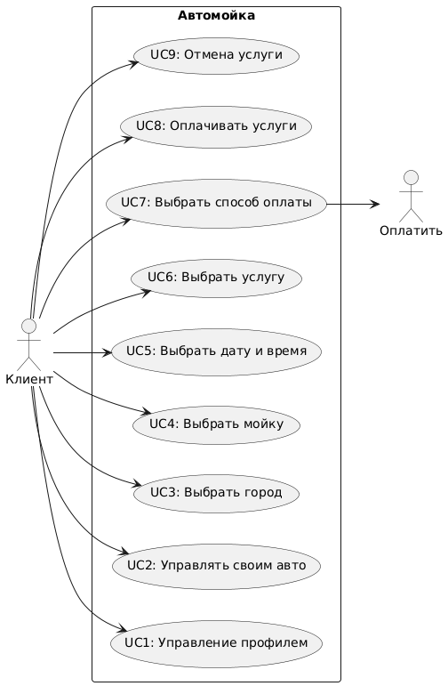
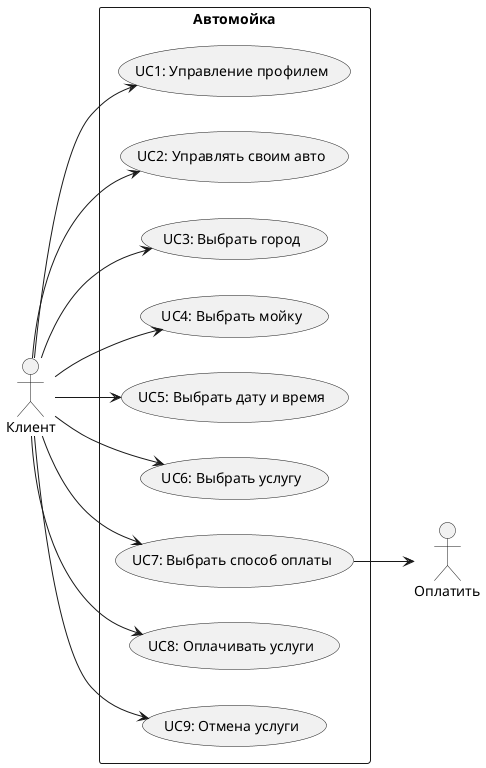

<h1>Учебное приложение по автомойке</h1>

<h2>Esatimates(Примерные показатели)</h2>  
Регион: Сахалинская область  
Численность населения: 500.000 человек.  
DAU: 15% от 500.000 = 75.000 человек.  
RPS: 75.000/24/3600 ~ 1 чел./сек.  

<h2>UseCase</h2>

<h2>Сценарии использования<h2> 
UC4: Найти и выбрать автомойку. 
Участники - Пользовательские приложения.  
Предусловия - Пользователь зарегетрирован и авторизован.  
Условие для запуска сценария - Пользователь нажимает кнопку "Найти Мойку". 
Признак успешности - Пользователь выбрад автомойку. 

я как дмитрий сузуки автозвук хочу услуги мойки с бассами чтобы мой слух прозрел.  
я как клиент-геймер хочу компьютерный клуб чтобы с кайфом играть в ксочку пока моится тачка.  
 
