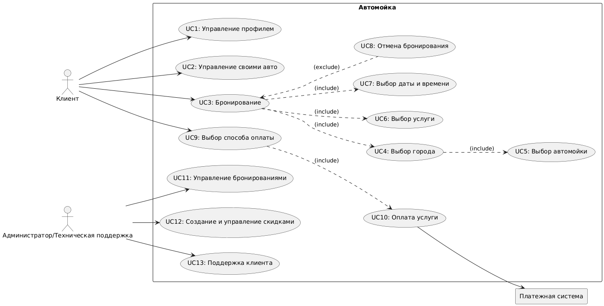
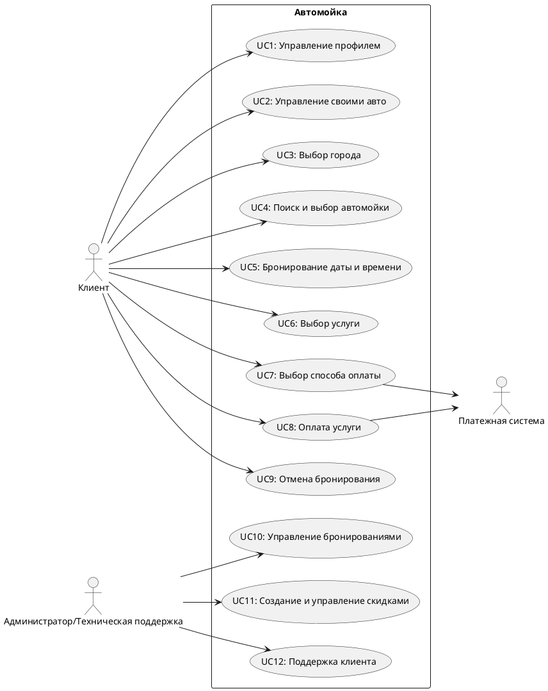
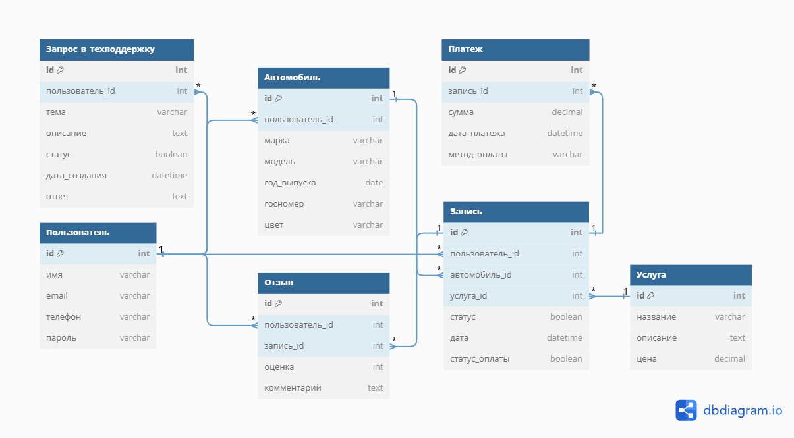
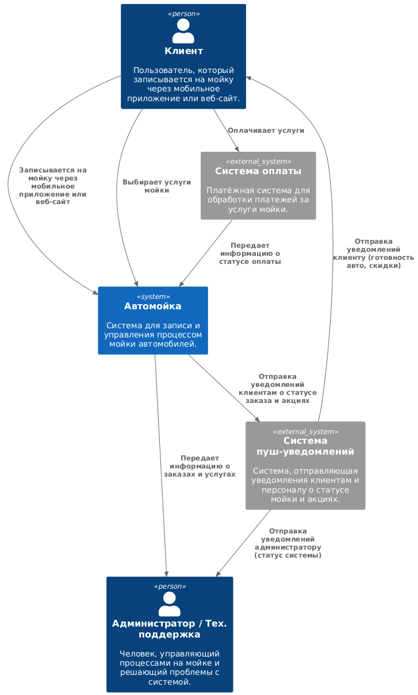
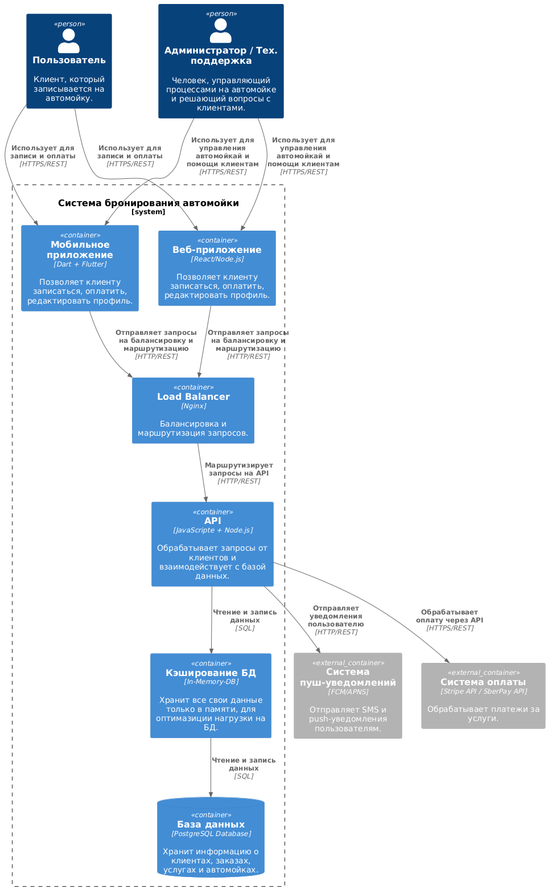
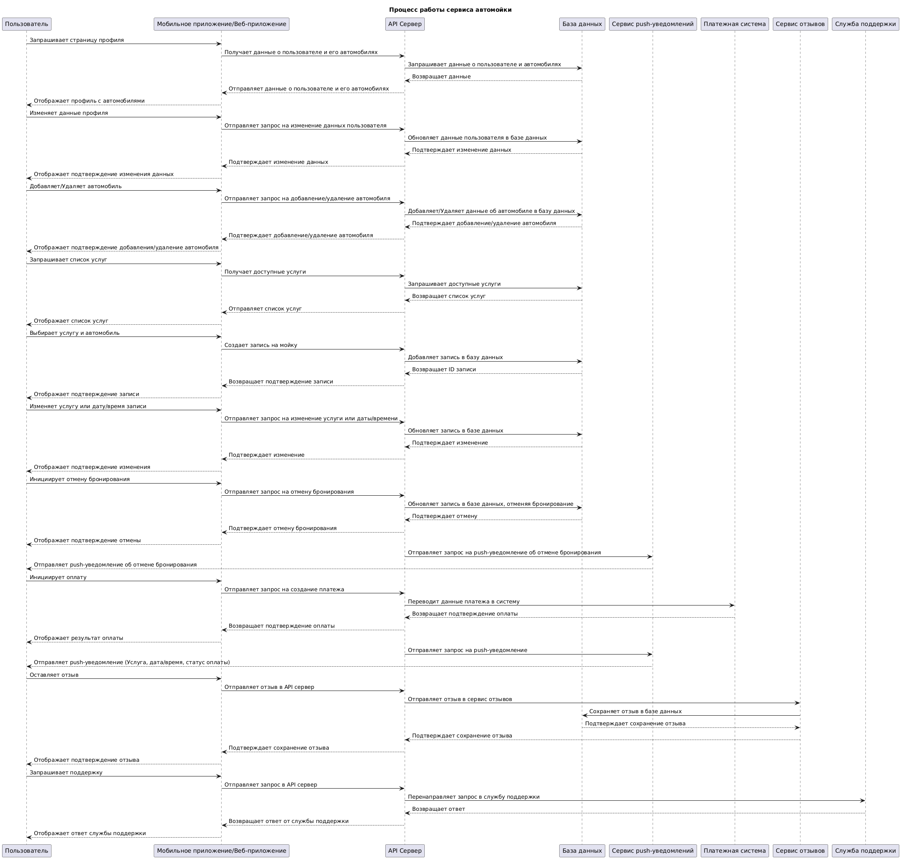

# Приложение для автомойки (Car Wash App) - Учебное приложение

## 📖 User Story

1. Я, как **ночной водитель**, хочу **услугу ночной мойки** 🌙, чтобы **экономить время и избегать очередей**.  
2. Я, как **владелец ретро-авто**, хочу **деликатную мойку с безопасными средствами** 🚗, чтобы **не повредить лакокрасочное покрытие**.  
3. Я, как **занятый человек**, хочу **услугу мойки на выезд** 🚐, чтобы **экономить время**.  
4. Я, как **владелец электромобиля**, хочу **доступ к зарядной станции во время мойки** ⚡, чтобы **зарядить авто одновременно с уходом за ним**.  
5. Я, как **любитель кофе**, хочу **кафе с качественными напитками** ☕, чтобы **наслаждаться ожиданием**.  
6. Я, как **активный пользователь мобильных приложений**, хочу **онлайн-запись с выбором времени и услуг** 📱, чтобы **планировать мойку удобно и быстро**.  
7. Я, как **владелец нового авто**, хочу **услугу нанесения защитного покрытия** 🛡️, чтобы **сохранить его вид и защитить от внешних воздействий**.  
8. Я, как **любитель животных**, хочу **услугу освижетеля воздуха** 🐾, чтобы **избавиться от запахов и бактерий**.  
9. Я, как **Клиент**, хочу **получать уведомление о готовности авто после мойки** 🕒, чтобы **знать, когда забирать машину**.  
10. Я, как **Клиент**, хочу **получать уведомления о скидках** 📢, чтобы **пользоваться выгодными предложениями на мойку**.  
11. Я, как **любитель бездорожья**, хочу **услуги глубокой мойки автомобиля** 🚙, чтобы **удалять сильные загрязнения с внедорожника**.  
12. Я, как **солидный человек**, хочу **доступ к услугам премиум-класса** 💼, чтобы **поддерживать свой статус**.  
13. Я, как **таксист**, хочу **ежедневное время со скидками на мойку** ⏳, чтобы **экономить на регулярном обслуживании**.
14. Я, как **автолюбитель**, хочу **услугу быстрой экспресс-мойки** ⏱️, чтобы **сэкономить время на уход за авто**.  
15. Я, как **владелец крупногабаритного авто**, хочу **удобный доступ к просторным боксам** 🚛, чтобы **быстро обслуживать свой транспорт**.  
16. Я, как **бизнесмен**, хочу **пакет услуг для корпоративного автопарка** 📊, чтобы **экономить на обслуживании машин компании**.      
17. Я, как **путешественник на автофургоне**, хочу **специальные боксы для кемперов** 🚐, чтобы **удобно помыть свой дом на колесах**.  
18. Я, как **житель снежных районов**, хочу **услугу обработки кузова антигололедным составом** ❄️, чтобы **защитить авто от соли и реагентов**.  
19. Я, как **владелец элитного авто**, хочу **персонального менеджера на мойке** 🤵, чтобы **получать индивидуальное обслуживание**.  
20. Я, как **автовладелец, часто путешествующий с детьми**, хочу **услугу чистки детских автокресел** 👶, чтобы **поддерживать их чистоту и гигиену**.  

## 🎯 Use Case Diagram



UserCase для этой структуры на [PlantTextUML](https://www.planttext.com/). 🔗

<details>
  <summary><h2>🧑‍💻🧑🏼‍💻🧑🏿‍💻Код:UserCase</h2></summary>
  


</details>

## Сценарии использования

### UC1: Управление профилем
- **Участники** – Пользователь (клиент).  
- **Предусловия** – Пользователь зарегистрирован и авторизован.  
- **Условие для запуска сценария** – Пользователь переходит в раздел "Профиль" в мобильном приложении или на веб-сайте.  
- **Признак успешности** – Пользователь может просматривать и редактировать свои данные.

#### Базовый сценарий
1. Система отображает экран с информацией профиля клиента.  
2. Клиент может редактировать данные, такие как имя, контактная информация и предпочтения.  
3. Система проверяет правильность введённых данных.  
4. Система сохраняет обновления в базе данных.  
5. Система отображает сообщение об успешном обновлении профиля.  
6. ✅ Сценарий завершён.

---

### UC2: Управление своими авто
- **Участники** – Пользователь (клиент).  
- **Предусловия** – Пользователь зарегистрирован и авторизован.  
- **Условие для запуска сценария** – Пользователь переходит в раздел "Мои автомобили".  
- **Признак успешности** – Пользователь может добавлять, удалять и редактировать информацию об автомобилях.

#### Базовый сценарий
1. Система отображает список автомобилей пользователя.  
2. Пользователь может выбрать автомобиль для редактирования или добавления нового.  
3. Пользователь вводит данные автомобиля (марка, модель, год выпуска).  
4. Система сохраняет данные автомобиля в базе.  
5. Система отображает сообщение об успешном добавлении/редактировании автомобиля.  
6. ✅ Сценарий завершён.

---

### UC3: Выбор города
- **Участники** – Пользователь (клиент).  
- **Предусловия** – Пользователь зарегистрирован и авторизован.  
- **Условие для запуска сценария** – Пользователь переходит на экран выбора города при регистрации или в настройках.  
- **Признак успешности** – Пользователь выбрал город, и система сохраняет его.

#### Базовый сценарий
1. Система отображает список доступных городов.  
2. Пользователь выбирает свой город.  
3. Система сохраняет выбранный город.  
4. Система отображает экран с подтверждением выбора города.  
5. ✅ Сценарий завершён.

---

### UC4: Поиск и выбор автомойки
- **Участники** – Пользователь (клиент).  
- **Предусловия** – Пользователь зарегистрирован и авторизован.  
- **Условие для запуска сценария** – Пользователь нажимает кнопку "Найти Мойку".  
- **Признак успешности** – Пользователь выбрал автомойку.

#### Базовый сценарий
1. Система проверяет, что клиент передал свою геолокацию.  
   - **ЕСЛИ:** Геолокация отсутствует,  
     **ТО:** Система переходит к "Базовому сценарию 3" 🔄.  
2. Система ищет ближайшие автомойки на основе геолокации клиента.  
3. Система формирует список ближайших автомоек.  
4. Система отображает экран с картой и списком автомоек.  
5. Система ожидает выбора автомойки.  
6. Система переходит к экрану выбора услуг.  
7. ✅ Сценарий завершён.

#### Базовый сценарий 2
1. Система выводит сообщение с просьбой разрешить передачу геолокации.  
2. **ЕСЛИ:** Клиент разрешил доступ к геолокации,  
   **ТО:** Система переходит к "Базовому сценарию шаг 2" 📍.  
   **ИНАЧЕ:** Система переходит к "Базовому сценарию 3" 🔄.  

#### Базовый сценарий 3
1. Система отображает поле для ввода адреса.  
2. Система ожидает от клиента ввода адреса.  
3. Система переходит к "Базовому сценарию шаг 2" 📍.

---

### UC5: Бронирование даты и времени
- **Участники** – Пользователь (клиент).  
- **Предусловия** – Пользователь зарегистрирован и авторизован.  
- **Условие для запуска сценария** – Пользователь выбрал автомойку и услугу.  
- **Признак успешности** – Пользователь выбрал дату и время для мойки.

#### Базовый сценарий
1. Система отображает календарь с доступными датами и временем.  
2. Пользователь выбирает дату и время для записи на мойку.  
3. Система проверяет доступность выбранного времени.  
4. Система подтверждает запись и отображает информацию о бронировании.  
5. Система отправляет уведомление о бронировании пользователю 📲.  
6. ✅ Сценарий завершён.

---

### UC6: Выбор услуги
- **Участники** – Пользователь (клиент).  
- **Предусловия** – Пользователь зарегистрирован и авторизован.  
- **Условие для запуска сценария** – Пользователь выбрал автомойку.  
- **Признак успешности** – Пользователь выбрал услугу.

#### Базовый сценарий
1. Система отображает список доступных услуг для выбранной мойки.  
2. Пользователь выбирает услугу (например, стандартная мойка, глубокая мойка, полировка).  
3. Система сохраняет выбранную услугу.  
4. Система переходит к экрану выбора даты и времени.  
5. ✅ Сценарий завершён.

---

### UC7: Выбор способа оплаты
- **Участники** – Пользователь (клиент).  
- **Предусловия** – Пользователь выбрал услугу и дату.  
- **Условие для запуска сценария** – Пользователь нажимает "Выбрать способ оплаты".  
- **Признак успешности** – Пользователь выбрал способ оплаты.

#### Базовый сценарий
1. Система отображает список доступных способов оплаты (карта, мобильный платёж и т.д.).  
2. Пользователь выбирает способ оплаты.  
3. Система проверяет корректность данных.  
4. Система переходит к экрану подтверждения платежа.  
5. ✅ Сценарий завершён.

---

### UC8: Оплата услуги
- **Участники** – Пользователь (клиент).  
- **Предусловия** – Пользователь выбрал способ оплаты.  
- **Условие для запуска сценария** – Пользователь подтверждает оплату.  
- **Признак успешности** – Платеж успешно обработан.

#### Базовый сценарий
1. Система отправляет запрос в платёжную систему 💳.  
2. Платёжная система подтверждает успешную транзакцию.  
3. Система обновляет статус бронирования.  
4. Система отправляет подтверждение об оплате пользователю 💌.  
5. ✅ Сценарий завершён.

---

### UC9: Отмена услуги
- **Участники** – Пользователь (клиент).  
- **Предусловия** – Пользователь выбрал услугу и осуществил бронирование.  
- **Условие для запуска сценария** – Пользователь решает отменить свой заказ до начала выполнения услуги.  
- **Признак успешности** – Пользователь отменил услугу, и заказ был удалён.

#### Базовый сценарий
1. Система отображает информацию о текущем заказе.  
2. Пользователь нажимает кнопку "Отменить заказ" ❌.  
3. Система подтверждает отмену заказа у пользователя.  
4. Пользователь подтверждает отмену.  
5. Система удаляет заказ из базы данных.  
6. Система отправляет пользователю уведомление об отмене заказа 📩.  
7. ✅ Сценарий завершён.

---

### UC10: Обратная связь
- **Участники** – Пользователь (клиент).  
- **Предусловия** – Пользователь завершил использование услуг автомойки.  
- **Условие для запуска сценария** – Пользователь решает оставить отзыв о качестве услуги.  
- **Признак успешности** – Пользователь оставил отзыв, и он был успешно сохранён.

#### Базовый сценарий
1. Система отображает окно для ввода отзыва о услуге.  
2. Пользователь выбирает оценку услуги (от 1 до 5 звёзд) ⭐ и пишет комментарий.  
3. Система проверяет корректность введённого текста и оценки.  
4. Система сохраняет отзыв в базе данных.  
5. Система отправляет уведомление об успешной отправке отзыва.  
6. ✅ Сценарий завершён.

---

### UC11: Просмотр истории заказов
- **Участники** – Пользователь (клиент).  
- **Предусловия** – Пользователь зарегистрирован и авторизован.  
- **Условие для запуска сценария** – Пользователь хочет просмотреть свою историю заказов.  
- **Признак успешности** – Пользователь видит все свои предыдущие заказы.

#### Базовый сценарий
1. Система отображает список предыдущих заказов пользователя.  
2. Каждый заказ включает информацию о дате, времени, выбранной услуге и стоимости.  
3. Пользователь может просматривать детали каждого заказа.  
4. Система отображает возможность повторно заказать услугу или оставить отзыв.  
5. ✅ Сценарий завершён.

---

### UC12: Поддержка клиентов
- **Участники** – Пользователь (клиент), Техническая поддержка (админ).  
- **Предусловия** – Пользователь зарегистрирован и авторизован.  
- **Условие для запуска сценария** – Пользователь обращается в службу поддержки по вопросам, связанным с услугами.  
- **Признак успешности** – Техническая поддержка решает проблему клиента или предоставляет необходимую информацию.

#### Базовый сценарий
1. Пользователь нажимает кнопку "Связаться с поддержкой" в мобильном приложении или на веб-сайте.  
2. Система предоставляет форму для ввода вопроса или проблемы.  
3. Пользователь вводит описание проблемы или вопроса и нажимает "Отправить".  
4. Система передаёт запрос в службу поддержки.  
5. Техническая поддержка обрабатывает запрос и отвечает пользователю через приложение или по электронной почте.  
6. Система уведомляет пользователя о поступившем ответе.  
7. ✅ Сценарий завершён.


## 🗄️ ERD (Entity-Relationship Diagram)



## Описание таблиц

### 1. **Пользователь** 👤
Хранит информацию о пользователях (имя, email, телефон, роль).

### 2. **Автомобиль** 🚗
Содержит данные об автомобилях пользователей, включая марку, модель, госномер и привязку к пользователю.

### 3. **Услуга** 🧽
Описание услуг автомойки (название, описание, цена).

### 4. **Запись** 📅
Информация о записи на мойку, связывающая пользователя, автомобиль и услугу с датой и статусом.

### 5. **Платеж** 💳
Данные о платежах за услуги, включая сумму, дату и метод оплаты.

### 6. **Отзыв** ⭐
Отзывы пользователей об услугах с оценкой и комментарием.

### 7. **Запрос в техподдержку** 🆘
Запросы пользователей в техподдержку с темой, описанием, статусом и ответом.

---

ERD для этой структуры на [dbdiagram.io](https://dbdiagram.io/). 🔗

<details>
  <summary><h2>🧑‍💻🧑🏼‍💻🧑🏿‍💻Код:ERD</h2></summary>

```plaintext

Table Пользователь {
  id int [pk]
  имя varchar
  email varchar
  телефон varchar
  пароль varchar
}

Table Автомобиль {
  id int [pk]
  пользователь_id int [ref: > Пользователь.id]
  марка varchar
  модель varchar
  год_выпуска date
  госномер varchar
  цвет varchar
}

Table Услуга {
  id int [pk]
  название varchar
  описание text
  цена decimal
}

Table Запись {
  id int [pk]
  пользователь_id int [ref: > Пользователь.id]
  автомобиль_id int [ref: > Автомобиль.id]
  услуга_id int [ref: > Услуга.id]
  статус boolean
  дата datetime
  статус_оплаты boolean
}

Table Платеж {
  id int [pk]
  запись_id int [ref: > Запись.id]
  сумма decimal
  дата_платежа datetime
  метод_оплаты varchar
}

Table Отзыв {
  id int [pk]
  пользователь_id int [ref: > Пользователь.id]
  запись_id int [ref: > Запись.id]
  оценка int
  комментарий text
}

Table Запрос_в_техподдержку {
  id int [pk]
  пользователь_id int [ref: > Пользователь.id]
  тема varchar
  описание text
  статус boolean
  дата_создания datetime
  ответ text
}

```

</details>

## 🏗️ C4 Model
### Level 1: System Context
Общее представление системы и её взаимодействия с внешними участниками (например, клиентами и системой).

C4 Model для этой структуры на [PlantTextUML](https://www.plantuml.com/plantuml/uml/ZOvFIyGm4CNl-HIrfowupSMJfvNrk6BnprccwT069fEGcI3zzhO5YoAAf_VcmVlDEub2rXB8N7bsL0Qi9jKajzPcU6z7hrFfYs1saHLPMnU3JGIyTewY0_dUdc-EtHgzFbni057CI_HsNXhW6NERLhxfC4la9croHnxakgelq2FLYtbCwYC3LVSeBlljgWzcXpJkq_selg2RE58Svpz0pxCeXaOs-UztyuJqVV3lAtR4bpa7Sq8UIg0F). 🔗



<details>
  <summary><h2>🧑‍💻🧑🏼‍💻🧑🏿‍💻Код:C1</h2></summary>

```plantuml

@startuml
!include https://raw.githubusercontent.com/plantuml-stdlib/C4-PlantUML/master/C4_Context.puml

' Определение участников
Person(клиент, "Клиент", "Пользователь, который записывается на мойку через мобильное приложение или веб-сайт.")
Person(администратор_техПоддержка, "Администратор / Тех. поддержка", "Человек, управляющий процессами на мойке и решающий проблемы с системой.")
System(автомойка, "Автомойка", "Система для записи и управления процессом мойки автомобилей.")
System(системаОплаты, "Система оплаты", "Платёжная система для обработки платежей за услуги мойки.")
System(системаПушУведомлений, "Система пуш-уведомлений", "Система, отправляющая уведомления клиентам и персоналу о статусе мойки и акциях.")

' Взаимодействия
Rel(клиент, автомойка, "Записывается на мойку через мобильное приложение или веб-сайт")
Rel(клиент, автомойка, "Выбирает услуги мойки")
Rel(клиент, системаОплаты, "Оплачивает услуги")
Rel(системаОплаты, автомойка, "Передает информацию о статусе оплаты")
Rel(автомойка, администратор_техПоддержка, "Передает информацию о заказах и услугах")
Rel(автомойка, системаПушУведомлений, "Отправка уведомлений клиентам о статусе заказа и акциях")
Rel(системаПушУведомлений, клиент, "Отправка уведомлений клиенту (готовность авто, скидки)")
Rel(системаПушУведомлений, администратор_техПоддержка, "Отправка уведомлений администратору (статус системы)")
@enduml

```

</details>

### Level 2: Container Diagram
Детализация контейнеров приложения: мобильное приложение, веб-сервер, база данных и т.д.



<details>
  <summary><h2>🧑‍💻🧑🏼‍💻🧑🏿‍💻Код:C2</h2></summary>

```plantuml

@startuml
!include https://raw.githubusercontent.com/plantuml-stdlib/C4-PlantUML/master/C4_Container.puml

' Пользователь системы
Person(user, "Пользователь", "Клиент, который записывается на автомойку.")

' Граница системы
System_Boundary(c2, "Система бронирования автомойки") {
    Container(mobileApp, "Мобильное приложение", "Kotlin + Android Studio", "Позволяет клиенту записаться, оплатить, редактировать профиль.")
    Container(webApp, "Веб-приложение", "React/Node.js", "Позволяет клиенту записаться, оплатить, редактировать профиль.")
    Container(loadBalancer, "Load Balancer", "Nginx", "Балансировка и маршрутизация запросов.")
    Container(api, "API", "Python/Flask", "Обрабатывает запросы от клиентов и взаимодействует с базой данных.")
    ContainerDb(database, "База данных", "Oracle Database", "Хранит информацию о клиентах, заказах, услугах и автомойках.")
}

' Внешние системы вне границы
Container_Ext(notificationSystem, "Система пуш-уведомлений", "Firebase Cloud Messaging", "Отправляет SMS и push-уведомления пользователям.")
Container_Ext(paymentSystem, "Система оплаты", "Stripe API / SberPay API", "Обрабатывает платежи за услуги.")

' Связи пользователя с системой
Rel(user, mobileApp, "Использует для записи и оплаты", "HTTPS/REST")
Rel(user, webApp, "Использует для записи и оплаты", "HTTPS/REST")

' Внутренние связи
Rel(mobileApp, loadBalancer, "Отправляет запросы на балансировку и маршрутизацию", "HTTP/REST") 
Rel(webApp, loadBalancer, "Отправляет запросы на балансировку и маршрутизацию", "HTTP/REST")
Rel(loadBalancer, api, "Маршрутизирует запросы на API", "HTTP/REST")
Rel(api, database, "Чтение и запись данных", "JDBC/SQL")

' Взаимодействие с внешними системами
Rel(api, notificationSystem, "Отправляет уведомления пользователю", "HTTP/REST")
Rel(api, paymentSystem, "Обрабатывает оплату через API", "HTTPS/REST")
@enduml

```

</details>

## 🔄 Sequence Diagrams



Sequence Diagrams для этой структуры на [PlantTextUML](https://www.plantuml.com/plantuml/uml/). 🔗

```plantuml

@startuml
actor Пользователь
entity API
database БазаДанных

' Создание пользователя
Пользователь -> API : POST /user (Новый пользователь)
API -> БазаДанных : Сохранить пользователя
БазаДанных -> API : Пользователь создан
API -> Пользователь : Вернуть созданного пользователя

' Получить список пользователей
Пользователь -> API : GET /users
API -> БазаДанных : Получить список пользователей
БазаДанных -> API : Вернуть список пользователей
API -> Пользователь : Вернуть список пользователей

' Получить пользователя по ID
Пользователь -> API : GET /user/{UserId}
API -> БазаДанных : Получить пользователя по ID
БазаДанных -> API : Пользователь найден
API -> Пользователь : Вернуть информацию о пользователе

' Обновить пользователя
Пользователь -> API : PUT /user/{UserId} (Обновленный пользователь)
API -> БазаДанных : Обновить данные пользователя
БазаДанных -> API : Данные пользователя обновлены
API -> Пользователь : Вернуть сообщение об успехе

' Удалить пользователя
Пользователь -> API : DELETE /user/{UserId}
API -> БазаДанных : Удалить пользователя
БазаДанных -> API : Пользователь удален
API -> Пользователь : Вернуть сообщение об успехе

' Создание автомобиля
Пользователь -> API : POST /car (Новый автомобиль)
API -> БазаДанных : Сохранить автомобиль
БазаДанных -> API : Автомобиль создан
API -> Пользователь : Вернуть созданный автомобиль

' Получить список автомобилей
Пользователь -> API : GET /cars
API -> БазаДанных : Получить список автомобилей
БазаДанных -> API : Вернуть список автомобилей
API -> Пользователь : Вернуть список автомобилей

' Получить автомобиль по ID
Пользователь -> API : GET /car/{CarId}
API -> БазаДанных : Получить автомобиль по ID
БазаДанных -> API : Автомобиль найден
API -> Пользователь : Вернуть информацию об автомобиле

' Обновить автомобиль
Пользователь -> API : PUT /car/{CarId} (Обновленный автомобиль)
API -> БазаДанных : Обновить данные автомобиля
БазаДанных -> API : Данные автомобиля обновлены
API -> Пользователь : Вернуть сообщение об успехе

' Удалить автомобиль
Пользователь -> API : DELETE /car/{CarId}
API -> БазаДанных : Удалить автомобиль
БазаДанных -> API : Автомобиль удален
API -> Пользователь : Вернуть сообщение об успехе

' Создание услуги
Пользователь -> API : POST /service (Новая услуга)
API -> БазаДанных : Сохранить услугу
БазаДанных -> API : Услуга создана
API -> Пользователь : Вернуть созданную услугу

' Получить список услуг
Пользователь -> API : GET /services
API -> БазаДанных : Получить список услуг
БазаДанных -> API : Вернуть список услуг
API -> Пользователь : Вернуть список услуг

' Получить услугу по ID
Пользователь -> API : GET /service/{ServiceId}
API -> БазаДанных : Получить услугу по ID
БазаДанных -> API : Услуга найдена
API -> Пользователь : Вернуть информацию об услуге

' Обновить услугу
Пользователь -> API : PUT /service/{ServiceId} (Обновленная услуга)
API -> БазаДанных : Обновить данные услуги
БазаДанных -> API : Данные услуги обновлены
API -> Пользователь : Вернуть сообщение об успехе

' Удалить услугу
Пользователь -> API : DELETE /service/{ServiceId}
API -> БазаДанных : Удалить услугу
БазаДанных -> API : Услуга удалена
API -> Пользователь : Вернуть сообщение об успехе

' Создание записи
Пользователь -> API : POST /booking (Новая запись)
API -> БазаДанных : Сохранить запись
БазаДанных -> API : Запись создана
API -> Пользователь : Вернуть созданную запись

' Получить список записей
Пользователь -> API : GET /bookings
API -> БазаДанных : Получить список записей
БазаДанных -> API : Вернуть список записей
API -> Пользователь : Вернуть список записей

' Получить запись по ID
Пользователь -> API : GET /booking/{BookingId}
API -> БазаДанных : Получить запись по ID
БазаДанных -> API : Запись найдена
API -> Пользователь : Вернуть информацию о записи

' Обновить запись
Пользователь -> API : PUT /booking/{BookingId} (Обновленная запись)
API -> БазаДанных : Обновить данные записи
БазаДанных -> API : Данные записи обновлены
API -> Пользователь : Вернуть сообщение об успехе

' Удалить запись
Пользователь -> API : DELETE /booking/{BookingId}
API -> БазаДанных : Удалить запись
БазаДанных -> API : Запись удалена
API -> Пользователь : Вернуть сообщение об успехе

' Создание платежа
Пользователь -> API : POST /payment (Новый платеж)
API -> БазаДанных : Сохранить платеж
БазаДанных -> API : Платеж создан
API -> Пользователь : Вернуть созданный платеж

' Получить список платежей
Пользователь -> API : GET /payments
API -> БазаДанных : Получить список платежей
БазаДанных -> API : Вернуть список платежей
API -> Пользователь : Вернуть список платежей

' Получить платеж по ID
Пользователь -> API : GET /payment/{PaymentId}
API -> БазаДанных : Получить платеж по ID
БазаДанных -> API : Платеж найден
API -> Пользователь : Вернуть информацию о платеже

' Обновить платеж
Пользователь -> API : PUT /payment/{PaymentId} (Обновленный платеж)
API -> БазаДанных : Обновить данные платежа
БазаДанных -> API : Данные платежа обновлены
API -> Пользователь : Вернуть сообщение об успехе

' Удалить платеж
Пользователь -> API : DELETE /payment/{PaymentId}
API -> БазаДанных : Удалить платеж
БазаДанных -> API : Платеж удален
API -> Пользователь : Вернуть сообщение об успехе

' Создание отзыва
Пользователь -> API : POST /review (Новый отзыв)
API -> БазаДанных : Сохранить отзыв
БазаДанных -> API : Отзыв создан
API -> Пользователь : Вернуть созданный отзыв

' Получить список отзывов
Пользователь -> API : GET /reviews
API -> БазаДанных : Получить список отзывов
БазаДанных -> API : Вернуть список отзывов
API -> Пользователь : Вернуть список отзывов

' Получить отзыв по ID
Пользователь -> API : GET /review/{ReviewId}
API -> БазаДанных : Получить отзыв по ID
БазаДанных -> API : Отзыв найден
API -> Пользователь : Вернуть информацию об отзыве

' Обновить отзыв
Пользователь -> API : PUT /review/{ReviewId} (Обновленный отзыв)
API -> БазаДанных : Обновить данные отзыва
БазаДанных -> API : Данные отзыва обновлены
API -> Пользователь : Вернуть сообщение об успехе

' Удалить отзыв
Пользователь -> API : DELETE /review/{ReviewId}
API -> БазаДанных : Удалить отзыв
БазаДанных -> API : Отзыв удален
API -> Пользователь : Вернуть сообщение об успехе

' Создание запроса в техподдержку
Пользователь -> API : POST /support (Новый запрос)
API -> БазаДанных : Сохранить запрос в техподдержку
БазаДанных -> API : Запрос создан
API -> Пользователь : Вернуть созданный запрос

' Получить список запросов в техподдержку
Пользователь -> API : GET /supports
API -> БазаДанных : Получить список запросов
БазаДанных -> API : Вернуть список запросов
API -> Пользователь : Вернуть список запросов

' Получить запрос по ID
Пользователь -> API : GET /support/{SupportId}
API -> БазаДанных : Получить запрос по ID
БазаДанных -> API : Запрос найден
API -> Пользователь : Вернуть информацию о запросе

' Обновить запрос в техподдержку
Пользователь -> API : PUT /support/{SupportId} (Обновленный запрос)
API -> БазаДанных : Обновить данные запроса
БазаДанных -> API : Данные запроса обновлены
API -> Пользователь : Вернуть сообщение об успехе

' Удалить запрос в техподдержку
Пользователь -> API : DELETE /support/{SupportId}
API -> БазаДанных : Удалить запрос
БазаДанных -> API : Запрос удален
API -> Пользователь : Вернуть сообщение об успехе
@enduml

```

<details>
  <summary><h2>🧑‍💻🧑🏼‍💻🧑🏿‍💻Код:SequenceDiagrams</h2></summary>



</details>

## 📜 OpenAPI Specification
Документация API для взаимодействия с приложением находится [Здесь!Тык](OpenApi.yaml)

Для развёртывания [Swagger Editor](https://editor.swagger.io/). 🔗

## 🛠️ Technologies

Для разработки системы автомойки были выбраны современные, популярные и эффективные технологии, которые обеспечивают высокий уровень производительности, масштабируемости и удобства для пользователей.

### 1. **Dart + Flutter 📱 и **

Flutter и Dart был выбран для мобильного приложения благодаря своему удобству. Разработчики могут использовать один и тот же код для создания приложений для разных платформ (IOS и Android), что снижает время и стоимость разработки. Пакеты Flutter и Dart содержат много инструментов и плагинов, доступных в репозиториях. Они помогут ускорить рабочий процесс, предоставляя готовые решения для типичных задач.  А с помощью виджетов и шаблонов можно создавать привлекательный, динамический и отзывчивый UI, который будет одинаково хорошо работать на различных устройствах.

### 2. **React + Node.js 🌐**

Для веб-приложения мы использовали стек React + Node.js. React идеально подходит для создания динамичных и отзывчивых пользовательских интерфейсов с отличной производительностью. Node.js обеспечивает асинхронную обработку запросов, что ускоряет работу веб-приложения, а также позволяет обрабатывать множество соединений одновременно. Эти технологии хорошо масштабируются, что делает их отличным выбором для растущего бизнеса.

### 3. **Nginx (Load Balancer) ⚖️**

Nginx выбран для балансировки нагрузки и маршрутизации запросов, потому что это высокопроизводительный и надежный инструмент для обработки большого количества трафика. Nginx помогает обеспечить стабильную работу системы и поддерживает быструю обработку запросов, что критично для эффективной работы всех компонентов системы.

### 4. **Python + Flask (API) 🐍**

Python и Flask были выбраны для создания API из-за их гибкости и удобства. Python известен своей читаемостью и множеством библиотек, что ускоряет разработку. Flask обеспечивает быстрый и эффективный способ создания API, позволяя легко интегрировать систему с другими сервисами.

### 5. **Oracle Database 💾**

Для хранения данных о клиентах, заказах, услугах и автомойках была выбрана **Oracle Database**. Эта СУБД известна своей надежностью, масштабируемостью и безопасностью. Oracle идеально подходит для работы с большими объемами данных, гарантируя высокую производительность и защиту информации.

### 6. **Firebase Cloud Messaging (Notifications) 🔔**

Для отправки уведомлений пользователям используется **Firebase Cloud Messaging**. Эта система позволяет быстро и эффективно интегрировать push-уведомления как в мобильных приложениях, так и в веб-приложениях. Это улучшает пользовательский опыт, позволяя отправлять важные сообщения и напоминания.

### 7. **Stripe API / SberPay API 💳**

Для обработки платежей мы выбрали **Stripe API** и **SberPay API**. Эти системы позволяют легко и безопасно принимать различные виды платежей, обеспечивая надежную обработку транзакций. С их помощью пользователи могут быстро и безопасно оплатить услуги автомойки.

---

Эти технологии были выбраны не только за их высокую производительность и надежность, но и за возможность масштабирования, что обеспечит стабильную работу проекта на различных этапах его развития. 🚀

## 📊 Estimates (Примерные показатели)

| Показатель                                    | Значение           |
|----------------------------------------------|--------------------|
| **Регион**                                   | Сахалинская область |
| **Численность населения**                   | 500 000 человек    |
| **Доля активных пользователей (DAU)**       | 15%                |
| **Количество активных пользователей в день**| 75 000 человек     |
| **Общее количество заказов в день**         | 75 000 заказов     |
| **Среднее количество заказов в секунду (RPS)** | 0,87 заказов/секунда |

## 🔧 Рекомендации

- Масштабируемость системы для пиковых нагрузок.
- Балансировка нагрузки для равномерного распределения запросов.
- Кэширование для ускорения работы.
- Мониторинг и оповещения для обнаружения узких мест.
- Резервирование ресурсов для обеспечения отказоустойчивости.

