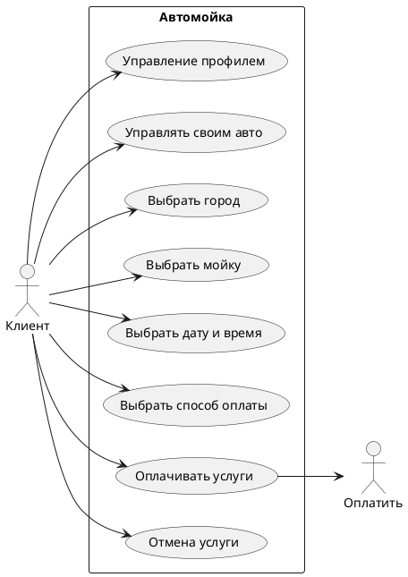

Esatimates(Примерные показатели)
Регион: Сахалинская область
Численность населения: 500.000 человек.
DAU: 15% от 500.000 = 75.000 человек.
RPS: 75.000/24/3600 ~ 1 чел./сек.

я как дмитрий сузуки автозвук хочу услуги мойки с бассами чтобы мой слух прозрел.  
я как клиент-геймер хочу компьютерный клуб чтобы с кайфом играть в ксочку пока моится тачка.  
 
