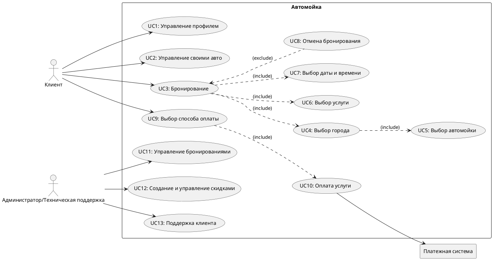

# Приложение для автомойки (Car Wash App) - Учебное приложение

## 📖 User Story

1. Я, как **ночной водитель**, хочу **услугу ночной мойки** 🌙, чтобы **экономить время и избегать очередей**.  
2. Я, как **владелец ретро-авто**, хочу **деликатную мойку с безопасными средствами** 🚗, чтобы **не повредить лакокрасочное покрытие**.  
3. Я, как **занятый человек**, хочу **услугу мойки на выезд** 🚐, чтобы **экономить время**.  
4. Я, как **владелец электромобиля**, хочу **доступ к зарядной станции во время мойки** ⚡, чтобы **зарядить авто одновременно с уходом за ним**.  
5. Я, как **любитель кофе**, хочу **кафе с качественными напитками** ☕, чтобы **наслаждаться ожиданием**.  
6. Я, как **активный пользователь мобильных приложений**, хочу **онлайн-запись с выбором времени и услуг** 📱, чтобы **планировать мойку удобно и быстро**.  
7. Я, как **владелец нового авто**, хочу **услугу нанесения защитного покрытия** 🛡️, чтобы **сохранить его вид и защитить от внешних воздействий**.  
8. Я, как **любитель животных**, хочу **услугу освижетеля воздуха** 🐾, чтобы **избавиться от запахов и бактерий**.  
9. Я, как **Клиент**, хочу **получать уведомление о готовности авто после мойки** 🕒, чтобы **знать, когда забирать машину**.  
10. Я, как **Клиент**, хочу **получать уведомления о скидках** 📢, чтобы **пользоваться выгодными предложениями на мойку**.  
11. Я, как **любитель бездорожья**, хочу **услуги глубокой мойки автомобиля** 🚙, чтобы **удалять сильные загрязнения с внедорожника**.  
12. Я, как **солидный человек**, хочу **доступ к услугам премиум-класса** 💼, чтобы **поддерживать свой статус**.  
13. Я, как **таксист**, хочу **ежедневное время со скидками на мойку** ⏳, чтобы **экономить на регулярном обслуживании**.
14. Я, как **автолюбитель**, хочу **услугу быстрой экспресс-мойки** ⏱️, чтобы **сэкономить время на уход за авто**.  
15. Я, как **владелец крупногабаритного авто**, хочу **удобный доступ к просторным боксам** 🚛, чтобы **быстро обслуживать свой транспорт**.  
16. Я, как **бизнесмен**, хочу **пакет услуг для корпоративного автопарка** 📊, чтобы **экономить на обслуживании машин компании**.      
17. Я, как **путешественник на автофургоне**, хочу **специальные боксы для кемперов** 🚐, чтобы **удобно помыть свой дом на колесах**.  
18. Я, как **житель снежных районов**, хочу **услугу обработки кузова антигололедным составом** ❄️, чтобы **защитить авто от соли и реагентов**.  
19. Я, как **владелец элитного авто**, хочу **персонального менеджера на мойке** 🤵, чтобы **получать индивидуальное обслуживание**.  
20. Я, как **автовладелец, часто путешествующий с детьми**, хочу **услугу чистки детских автокресел** 👶, чтобы **поддерживать их чистоту и гигиену**.  

## 🎯 Use Case Diagram


UserCase для этой структуры на [PlantTextUML](https://www.planttext.com/). 🔗

<details>
  <summary><h2>🧑‍💻🧑🏼‍💻🧑🏿‍💻Код:UserCase</h2></summary>
  


</details>

## Сценарии использования

## **UC1: Управление профилем 👤**  
- **Участники**: Пользователь (клиент).  
- **Предусловия**: Пользователь зарегистрирован и авторизован.  
- **Условие запуска**: Пользователь переходит в раздел "Профиль".  
- **Признак успешности**: Пользователь может просматривать и редактировать свои данные.  

### **Базовый сценарий ✅**  
1. Система проверяет доступность данных профиля.  
   - **ЕСЛИ**: Данные недоступны из-за сбоя,  
     **ТО**: Переход к **Альтернативному сценарию 1**.  
2. Система отображает экран с информацией профиля клиента.  
3. Клиент редактирует данные (имя, контактная информация и т.д.).  
4. Система проверяет правильность введённых данных.  
5. Система сохраняет обновления.  
6. Система отображает сообщение об успешном обновлении профиля.  
7. ✅ **Сценарий завершён**.  

### **Альтернативный сценарий 1: Ошибка при загрузке данных ⚠️**  
1. Система предлагает пользователю повторно загрузить страницу.  
2. **ЕСЛИ**: Ошибка сохраняется,  
   - Система отправляет уведомление в поддержку для устранения проблемы.  
3. Система отображает сообщение о технической ошибке.

---

## **UC2: Управление своими авто 🚗**  
- **Участники**: Пользователь (клиент).  
- **Предусловия**: Пользователь зарегистрирован и авторизован.  
- **Условие запуска**: Пользователь переходит в раздел "Мои автомобили".  
- **Признак успешности**: Пользователь может добавлять, удалять и редактировать информацию об автомобилях.  

### **Базовый сценарий ✅**  
1. Система проверяет наличие доступа к данным автомобилей.  
   - **ЕСЛИ**: Данные автомобилей недоступны из-за сбоя,  
     **ТО**: Переход к **Альтернативному сценарию 1**.  
2. Система отображает список автомобилей пользователя.  
3. Пользователь выбирает автомобиль для редактирования или добавления нового.  
4. Пользователь вводит данные автомобиля (марка, модель, год выпуска).  
5. Система сохраняет данные в базе.  
6. Система отображает сообщение об успешном обновлении данных.  
7. ✅ **Сценарий завершён**.  

### **Альтернативный сценарий 1: Ошибка загрузки данных ⚠️**  
1. Система сообщает пользователю об ошибке при загрузке данных.  
2. Система предлагает перезагрузить страницу или повторить запрос через несколько минут.  
3. Если ошибка сохраняется, создается запрос на техническую поддержку.  

---

## **UC3: Бронирование 📅**  
- **Участники**: Пользователь (клиент).  
- **Предусловия**: Пользователь зарегистрирован и авторизован.  
- **Условие запуска**: Пользователь нажимает "Забронировать".  
- **Признак успешности**: Пользователь успешно забронировал услугу.  

### **Базовый сценарий ✅**  
1. Система проверяет возможность начать процесс бронирования.  
   - **ЕСЛИ**: Сбой в работе системы,  
     **ТО**: Переход к **Альтернативному сценарию 1**.  
2. Система отображает список городов (UC4).  
3. Пользователь выбирает город.  
4. Система отображает список автомоек (UC5).  
5. Пользователь выбирает автомойку.  
6. Система предлагает выбрать услугу (UC6).  
7. Пользователь выбирает дату и время (UC7).  
8. Пользователь подтверждает выбор.  
9. Система сохраняет данные бронирования и отправляет уведомление пользователю.  
10. ✅ **Сценарий завершён**.  

### **Альтернативный сценарий 1: Ошибка в процессе бронирования ⚠️**  
1. Система сообщает о временной недоступности сервера.  
2. Пользователь получает предложение повторить бронирование позже или обратиться в поддержку.  

---

## **UC4: Выбор города 🌍**  
- **Участники**: Пользователь (клиент).  
- **Предусловия**: Пользователь зарегистрирован и авторизован.  
- **Условие запуска**: Система переходит на экран выбора города.  
- **Признак успешности**: Пользователь выбрал город.  

### **Базовый сценарий ✅**  
1. Система проверяет доступность списка городов.  
   - **ЕСЛИ**: Список недоступен,  
     **ТО**: Переход к **Альтернативному сценарию 1**.  
2. Система отображает список доступных городов.  
3. Пользователь выбирает город.  
4. Система сохраняет выбранный город.  
5. ✅ **Сценарий завершён**.  

### **Альтернативный сценарий 1: Ошибка загрузки списка городов ⚠️**  
1. Система сообщает об ошибке загрузки списка городов.  
2. Система предлагает пользователю ввести город вручную.  

---

## **UC5: Выбор автомойки 🚗**  
- **Участники**: Пользователь (клиент).  
- **Предусловия**: Пользователь зарегистрирован и авторизован.  
- **Условие для запуска сценария**: Пользователь нажимает кнопку "Найти Мойку".  
- **Признак успешности**: Пользователь выбрал автомойку.  

### **Базовый сценарий ✅**  
1. Система проверяет наличие геолокации пользователя.  
   - **ЕСЛИ**: Геолокация отсутствует,  
     **ТО**: Переход к **Альтернативному сценарию 1**.  
2. Система ищет ближайшие автомойки на основе геолокации пользователя.  
3. Система отображает список ближайших автомоек и карту.  
4. Пользователь выбирает автомойку из списка или на карте.  
5. ✅ **Сценарий завершён**: автомойка выбрана.  

### **Альтернативный сценарий 1: Геолокация отсутствует 📍**  
1. Система запрашивает у пользователя разрешение на передачу геолокации.  
   - **ЕСЛИ**: Пользователь разрешает доступ к геолокации,  
     **ТО**: Возврат к **Базовому сценарию шаг 1**.  
   - **ИНАЧЕ**: Переход к **Альтернативному сценарию 2**.  

### **Альтернативный сценарий 2: Ввод адреса вручную 📝**  
1. Система предлагает пользователю ввести адрес вручную.  
2. Пользователь вводит адрес.  
3. Система находит автомойки на основе введённого адреса.  
4. Переход к **Базовому сценарию шаг 2**.

---

## **UC6: Выбор услуги 🧼**  
- **Участники**: Пользователь (клиент).  
- **Предусловия**: Пользователь выбрал автомойку (UC5).  
- **Условие для запуска сценария**: Система отображает список услуг автомойки.  
- **Признак успешности**: Пользователь выбрал услугу.  

### **Базовый сценарий ✅**  
1. Система проверяет доступность списка услуг.  
   - **ЕСЛИ**: Список услуг недоступен,  
     **ТО**: Переход к **Альтернативному сценарию 1**.  
2. Система отображает список услуг автомойки (мойка кузова, салона и т.д.).  
3. Пользователь выбирает услугу.  
4. Система сохраняет выбор пользователя.  
5. ✅ **Сценарий завершён**.

### **Альтернативный сценарий 1: Ошибка загрузки услуг ⚠️**  
1. Система сообщает об ошибке загрузки услуг.  
2. Пользователю предлагается повторить попытку или выбрать другую автомойку.  

---

## **UC7: Выбор даты и времени 📅**  
- **Участники**: Пользователь (клиент).  
- **Предусловия**: Пользователь выбрал услугу (UC6).  
- **Условие для запуска сценария**: Система переходит к выбору даты и времени.  
- **Признак успешности**: Пользователь выбрал дату и время для бронирования.  

### **Базовый сценарий ✅**  
1. Система проверяет доступность расписания.  
   - **ЕСЛИ**: Расписание недоступно,  
     **ТО**: Переход к **Альтернативному сценарию 1**.  
2. Система отображает календарь и временные слоты для бронирования.  
3. Пользователь выбирает дату и время.  
4. Система проверяет доступность выбранного времени.  
5. Система сохраняет выбор пользователя.  
6. ✅ **Сценарий завершён**.

### **Альтернативный сценарий 1: Ошибка загрузки календаря ⚠️**  
1. Система сообщает об ошибке при загрузке календаря.  
2. Пользователю предлагается выбрать другую дату/время или повторить попытку позже.

---

## **UC8: Отмена бронирования ❌**  
- **Участники**: Пользователь (клиент).  
- **Предусловия**: Пользователь имеет активное бронирование.  
- **Условие для запуска сценария**: Пользователь инициирует отмену бронирования.  
- **Признак успешности**: Бронирование отменено, а пользователь получил подтверждение об отмене.  

### **Базовый сценарий ✅**  
1. Система проверяет статус бронирования.  
   - **ЕСЛИ**: Статус бронирования недоступен или уже отменен,  
     **ТО**: Переход к **Альтернативному сценарию 1**.  
2. Пользователь выбирает опцию "Отменить бронирование".  
3. Система запрашивает подтверждение отмены.  
4. Пользователь подтверждает отмену.  
5. Система обновляет статус бронирования как "Отменено".  
6. Система отправляет уведомление об успешной отмене.  
7. ✅ **Сценарий завершён**.

### **Альтернативный сценарий 1: Бронирование не может быть отменено ⚠️**  
1. Система сообщает, что бронирование не может быть отменено (например, истекло время отмены).  
2. Пользователю предлагается обратиться в поддержку для решения проблемы.  

---

## **UC9: Выбор способа оплаты 💳**  
- **Участники**: Пользователь (клиент).  
- **Предусловия**: Пользователь выбрал услугу и подтвердил бронирование.  
- **Условие для запуска сценария**: Пользователь переходит к выбору способа оплаты.  
- **Признак успешности**: Пользователь выбрал подходящий способ оплаты.  

### **Базовый сценарий ✅**  
1. Система проверяет доступность способов оплаты.  
   - **ЕСЛИ**: Способы оплаты недоступны,  
     **ТО**: Переход к **Альтернативному сценарию 1**.  
2. Система отображает доступные способы оплаты (например, SberPay).  
3. Пользователь выбирает предпочтительный способ оплаты.  
4. Система сохраняет выбор пользователя.  
5. ✅ **Сценарий завершён**.

### **Альтернативный сценарий 1: Ошибка загрузки способов оплаты ⚠️**  
1. Система сообщает об ошибке загрузки способов оплаты.  
2. Пользователю предлагается попробовать позже или выбрать оплату на месте, если доступно.  

---

## **UC10: Оплата услуги 💸**  
- **Участники**: Пользователь (клиент), Платежная система.  
- **Предусловия**: Пользователь выбрал способ оплаты (UC9).  
- **Условие для запуска сценария**: Пользователь инициирует оплату услуги.  
- **Признак успешности**: Платеж успешно обработан.  

### **Базовый сценарий ✅**  
1. Система проверяет связь с платежной системой.  
   - **ЕСЛИ**: Платежная система недоступна,  
     **ТО**: Переход к **Альтернативному сценарию 1**.  
2. Система отправляет запрос в платежную систему.  
3. Пользователь подтверждает платеж в интерфейсе платежной системы.  
4. Платежная система возвращает подтверждение об успешном платеже.  
5. Система сохраняет статус бронирования как "Оплачено".  
6. ✅ **Сценарий завершён**.

### **Альтернативный сценарий 1: Сбой в процессе оплаты ⚠️**  
1. Система сообщает о сбое в процессе оплаты.  
2. Пользователю предлагается повторить попытку оплаты или выбрать другой способ оплаты.

---

## **UC11: Управление бронированиями 📅**  
- **Участники**: Администратор (или Техническая поддержка).  
- **Предусловия**: Администратор имеет доступ к системе управления бронированиями.  
- **Условие для запуска сценария**: Администратор выбирает опцию управления бронированиями.  
- **Признак успешности**: Администратор может просматривать, редактировать или отменять бронирования.  

### **Базовый сценарий ✅**  
1. Система проверяет доступность данных бронирований.  
   - **ЕСЛИ**: Данные недоступны,  
     **ТО**: Переход к **Альтернативному сценарию 1**.  
2. Администратор просматривает список активных бронирований.  
3. Администратор выбирает бронирование для редактирования или отмены.  
4. Система отображает детали бронирования.  
5. Администратор вносит изменения (например, изменяет дату или отменяет бронирование).  
6. Система сохраняет изменения и уведомляет пользователя о статусе.  
7. ✅ **Сценарий завершён**.

### **Альтернативный сценарий 1: Ошибка загрузки данных бронирования ⚠️**  
1. Система сообщает об ошибке при загрузке данных бронирований.  
2. Администратору предлагается повторить запрос или обратиться в техническую поддержку.

---

## **UC12: Создание и управление скидками 💸**  
- **Участники**: Администратор (или Менеджер).  
- **Предусловия**: Администратор или менеджер авторизован и имеет права на управление скидками.  
- **Условие для запуска сценария**: Администратор выбирает опцию "Управление скидками".  
- **Признак успешности**: Администратор создает, редактирует или удаляет скидки.  

### **Базовый сценарий ✅**  
1. Система проверяет доступность данных о скидках.  
   - **ЕСЛИ**: Данные недоступны,  
     **ТО**: Переход к **Альтернативному сценарию 1**.  
2. Администратор просматривает список существующих скидок.  
3. Администратор создает новую скидку или редактирует существующую.  
4. Система проверяет правильность введённых данных (например, процент скидки, срок действия).  
5. Система сохраняет изменения или добавляет новую скидку.  
6. Система уведомляет администратор об успешном обновлении скидки.  
7. ✅ **Сценарий завершён**.

### **Альтернативный сценарий 1: Ошибка при загрузке данных о скидках ⚠️**  
1. Система сообщает об ошибке при загрузке данных о скидках.  
2. Администратору предлагается повторить попытку или обратиться в техническую поддержку.

---

## **UC13: Поддержка клиента 💬**  
- **Участники**: Пользователь (клиент), Администратор (или Техническая поддержка).  
- **Предусловия**: Пользователь зарегистрирован и авторизован.  
- **Условие для запуска сценария**: Пользователь выбирает опцию "Поддержка" или связывается с командой поддержки.  
- **Признак успешности**: Пользователь получил помощь и решение проблемы.  

### **Базовый сценарий ✅**  
1. Система проверяет доступность канала связи с поддержкой.  
   - **ЕСЛИ**: Канал связи недоступен,  
     **ТО**: Переход к **Альтернативному сценарию 1**.  
2. Пользователь выбирает способ связи (чат, звонок, электронная почта и т.д.).  
3. Система отображает форму для ввода сообщения или запрос на звонок.  
4. Пользователь описывает свою проблему или задает вопрос.  
5. Система передает запрос в поддержку.  
6. Администратор или поддержка отвечает пользователю, предоставляя решение.  
7. ✅ **Сценарий завершён**.

### **Альтернативный сценарий 1: Канал связи недоступен ⚠️**  
1. Система сообщает о недоступности канала связи.  
2. Пользователю предлагается выбрать другой способ связи или попробовать позже.


## 🗄️ ERD (Entity-Relationship Diagram)


## Описание таблиц

### 1. **Пользователь** 👤
Хранит информацию о пользователях (имя, email, телефон, роль).

### 2. **Автомобиль** 🚗
Содержит данные об автомобилях пользователей, включая марку, модель, госномер и привязку к пользователю.

### 3. **Услуга** 🧽
Описание услуг автомойки (название, описание, цена).

### 4. **Запись** 📅
Информация о записи на мойку, связывающая пользователя, автомобиль и услугу с датой и статусом.

### 5. **Платеж** 💳
Данные о платежах за услуги, включая сумму, дату и метод оплаты.

### 6. **Отзыв** ⭐
Отзывы пользователей об услугах с оценкой и комментарием.

### 7. **Запрос в техподдержку** 🆘
Запросы пользователей в техподдержку с темой, описанием, статусом и ответом.

---

ERD для этой структуры на [dbdiagram.io](https://dbdiagram.io/). 🔗

<details>
  <summary><h2>🧑‍💻🧑🏼‍💻🧑🏿‍💻Код:ERD</h2></summary>

```plaintext

Table User {
  id int [pk]
  name varchar
  email varchar
  phone varchar
  password varchar
}

Table Car {
  id int [pk]
  user_id int [ref: > User.id]
  make varchar
  model varchar
  year date
  license_plate varchar
  color varchar
}

Table Service {
  id int [pk]
  name varchar
  description text
  price decimal
}

Table Booking {
  id int [pk]
  user_id int [ref: > User.id]
  car_id int [ref: > Car.id]
  service_id int [ref: > Service.id]
  status boolean
  date datetime
  payment_status boolean
}

Table Payment {
  id int [pk]
  booking_id int [ref: > Booking.id]
  amount decimal
  payment_date datetime
  payment_method varchar
}

Table Review {
  id int [pk]
  user_id int [ref: > User.id]
  booking_id int [ref: > Booking.id]
  rating int
  comment text
}

Table Support_Request {
  id int [pk]
  user_id int [ref: > User.id]
  subject varchar
  description text
  status boolean
  creation_date datetime
  response text
}

```

</details>

## 🏗️ C4 Model
### Level 1: System Context
Общее представление системы и её взаимодействия с внешними участниками (например, клиентами и системой).

C4 Model для этой структуры на [PlantTextUML](https://www.plantuml.com/plantuml/uml/ZOvFIyGm4CNl-HIrfowupSMJfvNrk6BnprccwT069fEGcI3zzhO5YoAAf_VcmVlDEub2rXB8N7bsL0Qi9jKajzPcU6z7hrFfYs1saHLPMnU3JGIyTewY0_dUdc-EtHgzFbni057CI_HsNXhW6NERLhxfC4la9croHnxakgelq2FLYtbCwYC3LVSeBlljgWzcXpJkq_selg2RE58Svpz0pxCeXaOs-UztyuJqVV3lAtR4bpa7Sq8UIg0F). 🔗


<details>
  <summary><h2>🧑‍💻🧑🏼‍💻🧑🏿‍💻Код:C1</h2></summary>

```plantuml

@startuml
!include https://raw.githubusercontent.com/plantuml-stdlib/C4-PlantUML/master/C4_Context.puml

' Определение участников
Person(клиент, "Клиент", "Пользователь, который записывается на мойку через мобильное приложение или веб-сайт.")
Person(администратор_техПоддержка, "Администратор / Тех. поддержка", "Человек, управляющий процессами на мойке и решающий проблемы с системой.")
System(автомойка, "Автомойка", "Система для записи и управления процессом мойки автомобилей.")
System_Ext(системаОплаты, "Система оплаты", "Платёжная система для обработки платежей за услуги мойки.")
System_Ext(системаПушУведомлений, "Система пуш-уведомлений", "Система, отправляющая уведомления клиентам и персоналу о статусе мойки и акциях.")

' Взаимодействия
Rel(клиент, автомойка, "Записывается на мойку через мобильное приложение или веб-сайт")
Rel(клиент, автомойка, "Выбирает услуги мойки")
Rel(клиент, системаОплаты, "Оплачивает услуги")
Rel(системаОплаты, автомойка, "Передает информацию о статусе оплаты")
Rel(автомойка, администратор_техПоддержка, "Передает информацию о заказах и услугах")
Rel(автомойка, системаПушУведомлений, "Отправка уведомлений клиентам о статусе заказа и акциях")
Rel(системаПушУведомлений, клиент, "Отправка уведомлений клиенту (готовность авто, скидки)")
Rel(системаПушУведомлений, администратор_техПоддержка, "Отправка уведомлений администратору (статус системы)")
@enduml

```

</details>

### Level 2: Container Diagram
Детализация контейнеров приложения: мобильное приложение, веб-сервер, база данных и т.д.


<details>
  <summary><h2>🧑‍💻🧑🏼‍💻🧑🏿‍💻Код:C2</h2></summary>

```plantuml

@startuml
!include https://raw.githubusercontent.com/plantuml-stdlib/C4-PlantUML/master/C4_Container.puml

' Пользователь системы
Person(user, "Пользователь", "Клиент, который записывается на автомойку.")
Person(admin, "Администратор / Тех. поддержка", "Человек, управляющий процессами на автомойке и решающий вопросы с клиентами.")

' Граница системы
System_Boundary(c2, "Система бронирования автомойки") {
    Container(mobileApp, "Мобильное приложение", "Dart + Flutter", "Позволяет клиенту записаться, оплатить, редактировать профиль.")
    Container(webApp, "Веб-приложение", "React/Node.js", "Позволяет клиенту записаться, оплатить, редактировать профиль.")
    Container(loadBalancer, "Load Balancer", "Nginx", "Балансировка и маршрутизация запросов.")
    Container(api, "API", "JavaScripte + Node.js", "Обрабатывает запросы от клиентов и взаимодействует с базой данных.")
    Container(InMemoryDB, "Кэширование БД", "In-Memory-DB", "Хранит все свои данные только в памяти, для оптимазиции нагрузки на БД.")
    ContainerDb(database, "База данных", "PostgreSQL Database", "Хранит информацию о клиентах, заказах, услугах и автомойках.")
}

Container_Ext(notificationSystem, "Система пуш-уведомлений", "FCM/APNS", "Отправляет SMS и push-уведомления пользователям.")
Container_Ext(paymentSystem, "Система оплаты", "Stripe API / SberPay API", "Обрабатывает платежи за услуги.")

Rel(user, mobileApp, "Использует для записи и оплаты", "HTTPS/REST")
Rel(user, webApp, "Использует для записи и оплаты", "HTTPS/REST")

Rel(admin, mobileApp, "Использует для управления автомойкай и помощи клиентам", "HTTPS/REST")
Rel(admin, webApp, "Использует для управления автомойкай и помощи клиентам", "HTTPS/REST")

Rel(mobileApp, loadBalancer, "Отправляет запросы на балансировку и маршрутизацию", "HTTP/REST") 
Rel(webApp, loadBalancer, "Отправляет запросы на балансировку и маршрутизацию", "HTTP/REST")
Rel(loadBalancer, api, "Маршрутизирует запросы на API", "HTTP/REST")

Rel(api, InMemoryDB, "Чтение и запись данных", "SQL")
Rel(InMemoryDB, database, "Чтение и запись данных", "SQL")

Rel(api, notificationSystem, "Отправляет уведомления пользователю", "HTTP/REST")
Rel(api, paymentSystem, "Обрабатывает оплату через API", "HTTPS/REST")
@enduml

```

</details>

## 🔄 Sequence Diagrams


Sequence Diagrams для этой структуры на [PlantTextUML](https://www.plantuml.com/plantuml/uml/). 🔗

```plantuml

@startuml
actor Пользователь
entity API
database БазаДанных

' Создание пользователя
Пользователь -> API : POST /user (Новый пользователь)
API -> БазаДанных : Сохранить пользователя
БазаДанных -> API : Пользователь создан
API -> Пользователь : Вернуть созданного пользователя

' Получить список пользователей
Пользователь -> API : GET /users
API -> БазаДанных : Получить список пользователей
БазаДанных -> API : Вернуть список пользователей
API -> Пользователь : Вернуть список пользователей

' Получить пользователя по ID
Пользователь -> API : GET /user/{UserId}
API -> БазаДанных : Получить пользователя по ID
БазаДанных -> API : Пользователь найден
API -> Пользователь : Вернуть информацию о пользователе

' Обновить пользователя
Пользователь -> API : PUT /user/{UserId} (Обновленный пользователь)
API -> БазаДанных : Обновить данные пользователя
БазаДанных -> API : Данные пользователя обновлены
API -> Пользователь : Вернуть сообщение об успехе

' Удалить пользователя
Пользователь -> API : DELETE /user/{UserId}
API -> БазаДанных : Удалить пользователя
БазаДанных -> API : Пользователь удален
API -> Пользователь : Вернуть сообщение об успехе

' Создание автомобиля
Пользователь -> API : POST /car (Новый автомобиль)
API -> БазаДанных : Сохранить автомобиль
БазаДанных -> API : Автомобиль создан
API -> Пользователь : Вернуть созданный автомобиль

' Получить список автомобилей
Пользователь -> API : GET /cars
API -> БазаДанных : Получить список автомобилей
БазаДанных -> API : Вернуть список автомобилей
API -> Пользователь : Вернуть список автомобилей

' Получить автомобиль по ID
Пользователь -> API : GET /car/{CarId}
API -> БазаДанных : Получить автомобиль по ID
БазаДанных -> API : Автомобиль найден
API -> Пользователь : Вернуть информацию об автомобиле

' Обновить автомобиль
Пользователь -> API : PUT /car/{CarId} (Обновленный автомобиль)
API -> БазаДанных : Обновить данные автомобиля
БазаДанных -> API : Данные автомобиля обновлены
API -> Пользователь : Вернуть сообщение об успехе

' Удалить автомобиль
Пользователь -> API : DELETE /car/{CarId}
API -> БазаДанных : Удалить автомобиль
БазаДанных -> API : Автомобиль удален
API -> Пользователь : Вернуть сообщение об успехе

' Создание услуги
Пользователь -> API : POST /service (Новая услуга)
API -> БазаДанных : Сохранить услугу
БазаДанных -> API : Услуга создана
API -> Пользователь : Вернуть созданную услугу

' Получить список услуг
Пользователь -> API : GET /services
API -> БазаДанных : Получить список услуг
БазаДанных -> API : Вернуть список услуг
API -> Пользователь : Вернуть список услуг

' Получить услугу по ID
Пользователь -> API : GET /service/{ServiceId}
API -> БазаДанных : Получить услугу по ID
БазаДанных -> API : Услуга найдена
API -> Пользователь : Вернуть информацию об услуге

' Обновить услугу
Пользователь -> API : PUT /service/{ServiceId} (Обновленная услуга)
API -> БазаДанных : Обновить данные услуги
БазаДанных -> API : Данные услуги обновлены
API -> Пользователь : Вернуть сообщение об успехе

' Удалить услугу
Пользователь -> API : DELETE /service/{ServiceId}
API -> БазаДанных : Удалить услугу
БазаДанных -> API : Услуга удалена
API -> Пользователь : Вернуть сообщение об успехе

' Создание записи
Пользователь -> API : POST /booking (Новая запись)
API -> БазаДанных : Сохранить запись
БазаДанных -> API : Запись создана
API -> Пользователь : Вернуть созданную запись

' Получить список записей
Пользователь -> API : GET /bookings
API -> БазаДанных : Получить список записей
БазаДанных -> API : Вернуть список записей
API -> Пользователь : Вернуть список записей

' Получить запись по ID
Пользователь -> API : GET /booking/{BookingId}
API -> БазаДанных : Получить запись по ID
БазаДанных -> API : Запись найдена
API -> Пользователь : Вернуть информацию о записи

' Обновить запись
Пользователь -> API : PUT /booking/{BookingId} (Обновленная запись)
API -> БазаДанных : Обновить данные записи
БазаДанных -> API : Данные записи обновлены
API -> Пользователь : Вернуть сообщение об успехе

' Удалить запись
Пользователь -> API : DELETE /booking/{BookingId}
API -> БазаДанных : Удалить запись
БазаДанных -> API : Запись удалена
API -> Пользователь : Вернуть сообщение об успехе

' Создание платежа
Пользователь -> API : POST /payment (Новый платеж)
API -> БазаДанных : Сохранить платеж
БазаДанных -> API : Платеж создан
API -> Пользователь : Вернуть созданный платеж

' Получить список платежей
Пользователь -> API : GET /payments
API -> БазаДанных : Получить список платежей
БазаДанных -> API : Вернуть список платежей
API -> Пользователь : Вернуть список платежей

' Получить платеж по ID
Пользователь -> API : GET /payment/{PaymentId}
API -> БазаДанных : Получить платеж по ID
БазаДанных -> API : Платеж найден
API -> Пользователь : Вернуть информацию о платеже

' Обновить платеж
Пользователь -> API : PUT /payment/{PaymentId} (Обновленный платеж)
API -> БазаДанных : Обновить данные платежа
БазаДанных -> API : Данные платежа обновлены
API -> Пользователь : Вернуть сообщение об успехе

' Удалить платеж
Пользователь -> API : DELETE /payment/{PaymentId}
API -> БазаДанных : Удалить платеж
БазаДанных -> API : Платеж удален
API -> Пользователь : Вернуть сообщение об успехе

' Создание отзыва
Пользователь -> API : POST /review (Новый отзыв)
API -> БазаДанных : Сохранить отзыв
БазаДанных -> API : Отзыв создан
API -> Пользователь : Вернуть созданный отзыв

' Получить список отзывов
Пользователь -> API : GET /reviews
API -> БазаДанных : Получить список отзывов
БазаДанных -> API : Вернуть список отзывов
API -> Пользователь : Вернуть список отзывов

' Получить отзыв по ID
Пользователь -> API : GET /review/{ReviewId}
API -> БазаДанных : Получить отзыв по ID
БазаДанных -> API : Отзыв найден
API -> Пользователь : Вернуть информацию об отзыве

' Обновить отзыв
Пользователь -> API : PUT /review/{ReviewId} (Обновленный отзыв)
API -> БазаДанных : Обновить данные отзыва
БазаДанных -> API : Данные отзыва обновлены
API -> Пользователь : Вернуть сообщение об успехе

' Удалить отзыв
Пользователь -> API : DELETE /review/{ReviewId}
API -> БазаДанных : Удалить отзыв
БазаДанных -> API : Отзыв удален
API -> Пользователь : Вернуть сообщение об успехе

' Создание запроса в техподдержку
Пользователь -> API : POST /support (Новый запрос)
API -> БазаДанных : Сохранить запрос в техподдержку
БазаДанных -> API : Запрос создан
API -> Пользователь : Вернуть созданный запрос

' Получить список запросов в техподдержку
Пользователь -> API : GET /supports
API -> БазаДанных : Получить список запросов
БазаДанных -> API : Вернуть список запросов
API -> Пользователь : Вернуть список запросов

' Получить запрос по ID
Пользователь -> API : GET /support/{SupportId}
API -> БазаДанных : Получить запрос по ID
БазаДанных -> API : Запрос найден
API -> Пользователь : Вернуть информацию о запросе

' Обновить запрос в техподдержку
Пользователь -> API : PUT /support/{SupportId} (Обновленный запрос)
API -> БазаДанных : Обновить данные запроса
БазаДанных -> API : Данные запроса обновлены
API -> Пользователь : Вернуть сообщение об успехе

' Удалить запрос в техподдержку
Пользователь -> API : DELETE /support/{SupportId}
API -> БазаДанных : Удалить запрос
БазаДанных -> API : Запрос удален
API -> Пользователь : Вернуть сообщение об успехе
@enduml

```

<details>
  <summary><h2>🧑‍💻🧑🏼‍💻🧑🏿‍💻Код:SequenceDiagrams</h2></summary>



</details>

## 📜 OpenAPI Specification
Документация API для взаимодействия с приложением находится [Здесь!Тык](OpenApi.yaml)

Для развёртывания [Swagger Editor](https://editor.swagger.io/). 🔗

## 🛠️ Technologies

Для разработки системы автомойки были выбраны современные, популярные и эффективные технологии, которые обеспечивают высокий уровень производительности, масштабируемости и удобства для пользователей.

### 1. **Dart + Flutter 📱**

Flutter и Dart был выбран для мобильного приложения благодаря своему удобству. Разработчики могут использовать один и тот же код для создания приложений для разных платформ (IOS и Android), что снижает время и стоимость разработки. Пакеты Flutter и Dart содержат много инструментов и плагинов, доступных в репозиториях. Они помогут ускорить рабочий процесс, предоставляя готовые решения для типичных задач.  А с помощью виджетов и шаблонов можно создавать привлекательный, динамический и отзывчивый UI, который будет одинаково хорошо работать на различных устройствах.

### 2. **React + Node.js 🌐**

Для веб-приложения мы использовали стек React + Node.js. Используя React с Node.js, разработчикам не нужно изучать сложные языки бэкенда, такие как Ruby или Python. Они могут использовать один язык для React-разработки пользовательского интерфейса и Node.js-разработки на стороне сервера. Это избавит от необходимости переключаться между различными языками программирования и фреймворков, сэкономив время, деньги и ресурсы. Node.JS имеет событийно-ориентированную архитектуру, что делает его идеальным для приложений, работающих с данными, поступающими в реальном времени.

### 3. **Nginx (Load Balancer) ⚖️**

Nginx выбран для балансировки нагрузки и маршрутизации запросов, потому что это высокопроизводительный и надежный инструмент для обработки большого количества трафика. Nginx помогает обеспечить стабильную работу системы и поддерживает быструю обработку запросов, что критично для эффективной работы всех компонентов системы.

### 4. **JavaScripte + Node.js (API) 🐍**

JavaScripte и Node.js были выбраны для создания API из-за удобства разработки, используя один язык как для API так и для Веб-приложения с помощью React. Это избавит от необходимости переключаться между различными языками программирования и фреймворков, сэкономив время, деньги и ресурсы.

### 5. **PostgreSQL Database 💾**

Для хранения данных о клиентах, заказах, услугах и автомойках была выбрана **PostgreSQL Database**. Эта СУБД известна своей надежностью, масштабируемостью, открытым кодом, высокой надёжность и безопасность.

### 6. **FCM (Firebase Cloud Messaging) и APNS (Apple Push Notification Service) - (push-уведомления) 🔔**

Для отправки уведомлений пользователям используется **Firebase Cloud Messaging** для Android пользователей и **Apple Push Notification Service** для IOS пользователей. Эти система позволяет быстро и эффективно интегрировать push-уведомления как в мобильных приложениях, так и в веб-приложениях. Это улучшает пользовательский опыт, позволяя отправлять важные сообщения и напоминания.

### 7. **Stripe API / SberPay API 💳**

Для обработки платежей мы выбрали **Stripe API** и **SberPay API**. Эти системы позволяют легко и безопасно принимать различные виды платежей, обеспечивая надежную обработку транзакций. С их помощью пользователи могут быстро и безопасно оплатить услуги автомойки.

---

## 📊 Estimates (Примерные показатели)

| Показатель                                    | Значение           |
|----------------------------------------------|--------------------|
| **Регион**                                   | Сахалинская область |
| **Численность населения**                   | 500 000 человек    |
| **Доля активных пользователей (DAU)**       | 15%                |
| **Количество активных пользователей в день**| 75 000 человек     |
| **Общее количество заказов в день**         | 75 000 заказов     |
| **Среднее количество заказов в секунду (RPS)** | 0,87 заказов/секунда |

## 🔧 Рекомендации

- Масштабируемость системы для пиковых нагрузок.
- Балансировка нагрузки для равномерного распределения запросов.
- Кэширование для ускорения работы.
- Мониторинг и оповещения для обнаружения узких мест.
- Резервирование ресурсов для обеспечения отказоустойчивости.

