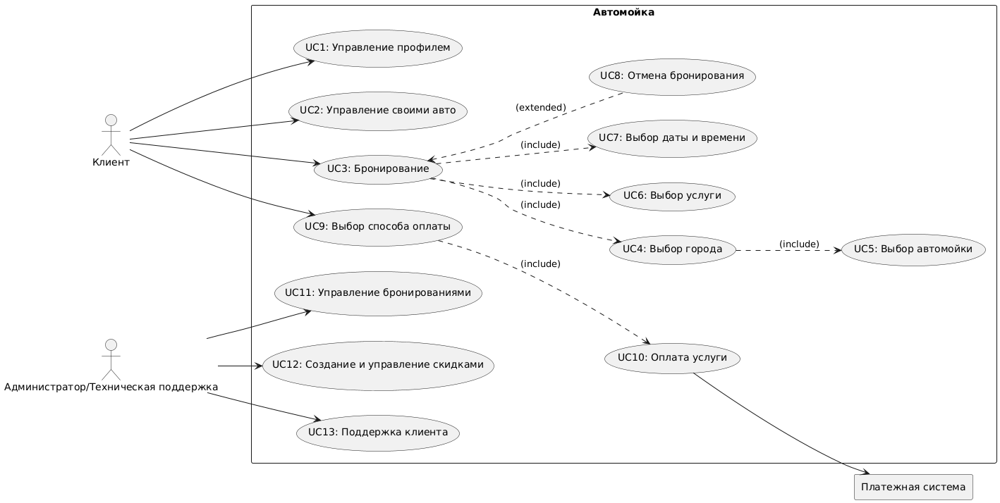
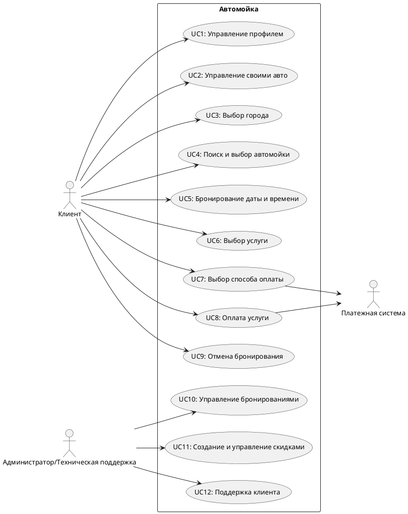

# Приложение для автомойки (Car Wash App) - Учебное приложение

## 📖 User Story

1. Я, как **ночной водитель**, хочу **услугу ночной мойки** 🌙, чтобы **экономить время и избегать очередей**.  
2. Я, как **владелец ретро-авто**, хочу **деликатную мойку с безопасными средствами** 🚗, чтобы **не повредить лакокрасочное покрытие**.  
3. Я, как **занятый человек**, хочу **услугу мойки на выезд** 🚐, чтобы **экономить время**.  
4. Я, как **владелец электромобиля**, хочу **доступ к зарядной станции во время мойки** ⚡, чтобы **зарядить авто одновременно с уходом за ним**.  
5. Я, как **любитель кофе**, хочу **кафе с качественными напитками** ☕, чтобы **наслаждаться ожиданием**.  
6. Я, как **активный пользователь мобильных приложений**, хочу **онлайн-запись с выбором времени и услуг** 📱, чтобы **планировать мойку удобно и быстро**.  
7. Я, как **владелец нового авто**, хочу **услугу нанесения защитного покрытия** 🛡️, чтобы **сохранить его вид и защитить от внешних воздействий**.  
8. Я, как **любитель животных**, хочу **услугу освижетеля воздуха** 🐾, чтобы **избавиться от запахов и бактерий**.  
9. Я, как **Клиент**, хочу **получать уведомление о готовности авто после мойки** 🕒, чтобы **знать, когда забирать машину**.  
10. Я, как **Клиент**, хочу **получать уведомления о скидках** 📢, чтобы **пользоваться выгодными предложениями на мойку**.  
11. Я, как **любитель бездорожья**, хочу **услуги глубокой мойки автомобиля** 🚙, чтобы **удалять сильные загрязнения с внедорожника**.  
12. Я, как **солидный человек**, хочу **доступ к услугам премиум-класса** 💼, чтобы **поддерживать свой статус**.  
13. Я, как **таксист**, хочу **ежедневное время со скидками на мойку** ⏳, чтобы **экономить на регулярном обслуживании**.
14. Я, как **автолюбитель**, хочу **услугу быстрой экспресс-мойки** ⏱️, чтобы **сэкономить время на уход за авто**.  
15. Я, как **владелец крупногабаритного авто**, хочу **удобный доступ к просторным боксам** 🚛, чтобы **быстро обслуживать свой транспорт**.  
16. Я, как **бизнесмен**, хочу **пакет услуг для корпоративного автопарка** 📊, чтобы **экономить на обслуживании машин компании**.      
17. Я, как **путешественник на автофургоне**, хочу **специальные боксы для кемперов** 🚐, чтобы **удобно помыть свой дом на колесах**.  
18. Я, как **житель снежных районов**, хочу **услугу обработки кузова антигололедным составом** ❄️, чтобы **защитить авто от соли и реагентов**.  
19. Я, как **владелец элитного авто**, хочу **персонального менеджера на мойке** 🤵, чтобы **получать индивидуальное обслуживание**.  
20. Я, как **автовладелец, часто путешествующий с детьми**, хочу **услугу чистки детских автокресел** 👶, чтобы **поддерживать их чистоту и гигиену**.  

## 🎯 Use Case Diagram



UserCase для этой структуры на [PlantTextUML](https://www.planttext.com/).


```plantuml

@startuml
left to right direction
actor "Клиент" as client
actor "Администратор/Техническая поддержка" as adminSupport
actor "Платежная система" as paymentSystem

rectangle Автомойка {
  usecase "UC1: Управление профилем" as UC1
  usecase "UC2: Управление своими авто" as UC2
  usecase "UC3: Выбор города" as UC3
  usecase "UC4: Поиск и выбор автомойки" as UC4
  usecase "UC5: Бронирование даты и времени" as UC5
  usecase "UC6: Выбор услуги" as UC6
  usecase "UC7: Выбор способа оплаты" as UC7
  usecase "UC8: Оплата услуги" as UC8
  usecase "UC9: Отмена бронирования" as UC9
  usecase "UC10: Управление бронированиями" as UC10
  usecase "UC11: Создание и управление скидками" as UC11
  usecase "UC12: Поддержка клиента" as UC12
}

client --> UC1
client --> UC2
client --> UC3
client --> UC4
client --> UC5
client --> UC6
client --> UC7
client --> UC8
client --> UC9

adminSupport --> UC10
adminSupport --> UC11
adminSupport --> UC12

UC7 --> paymentSystem
UC8 --> paymentSystem
@enduml

```

## Сценарии использования

### UC1: Управление профилем
- **Участники** – Пользователь (клиент).  
- **Предусловия** – Пользователь зарегистрирован и авторизован.  
- **Условие для запуска сценария** – Пользователь переходит в раздел "Профиль" в мобильном приложении или на веб-сайте.  
- **Признак успешности** – Пользователь может просматривать и редактировать свои данные.

#### Базовый сценарий
1. Система отображает экран с информацией профиля клиента.  
2. Клиент может редактировать данные, такие как имя, контактная информация и предпочтения.  
3. Система проверяет правильность введённых данных.  
4. Система сохраняет обновления в базе данных.  
5. Система отображает сообщение об успешном обновлении профиля.  
6. Сценарий завершён.

---

### UC2: Управление своими авто
- **Участники** – Пользователь (клиент).  
- **Предусловия** – Пользователь зарегистрирован и авторизован.  
- **Условие для запуска сценария** – Пользователь переходит в раздел "Мои автомобили".  
- **Признак успешности** – Пользователь может добавлять, удалять и редактировать информацию об автомобилях.

#### Базовый сценарий
1. Система отображает список автомобилей пользователя.  
2. Пользователь может выбрать автомобиль для редактирования или добавления нового.  
3. Пользователь вводит данные автомобиля (марка, модель, год выпуска).  
4. Система сохраняет данные автомобиля в базе.  
5. Система отображает сообщение об успешном добавлении/редактировании автомобиля.  
6. Сценарий завершён.

---

### UC3: Выбор города
- **Участники** – Пользователь (клиент).  
- **Предусловия** – Пользователь зарегистрирован и авторизован.  
- **Условие для запуска сценария** – Пользователь переходит на экран выбора города при регистрации или в настройках.  
- **Признак успешности** – Пользователь выбрал город, и система сохраняет его.

#### Базовый сценарий
1. Система отображает список доступных городов.  
2. Пользователь выбирает свой город.  
3. Система сохраняет выбранный город.  
4. Система отображает экран с подтверждением выбора города.  
5. Сценарий завершён.

---

### UC4: Поиск и выбор автомойки
- **Участники** – Пользователь (клиент).  
- **Предусловия** – Пользователь зарегистрирован и авторизован.  
- **Условие для запуска сценария** – Пользователь нажимает кнопку "Найти Мойку".  
- **Признак успешности** – Пользователь выбрал автомойку.

#### Базовый сценарий
1. Система проверяет, что клиент передал свою геолокацию.  
   - **ЕСЛИ:** Геолокация отсутствует,  
     **ТО:** Система переходит к "Базовому сценарию 3".  
2. Система ищет ближайшие автомойки на основе геолокации клиента.  
3. Система формирует список ближайших автомоек.  
4. Система отображает экран с картой и списком автомоек.  
5. Система ожидает выбора автомойки.  
6. Система переходит к экрану выбора услуг.  
7. Сценарий завершён.

#### Базовый сценарий 2
1. Система выводит сообщение с просьбой разрешить передачу геолокации.  
2. **ЕСЛИ:** Клиент разрешил доступ к геолокации,  
   **ТО:** Система переходит к "Базовому сценарию шаг 2".  
   **ИНАЧЕ:** Система переходит к "Базовому сценарию 3".  

#### Базовый сценарий 3
1. Система отображает поле для ввода адреса.  
2. Система ожидает от клиента ввода адреса.  
3. Система переходит к "Базовому сценарию шаг 2".

---

### UC5: Бронирование даты и времени
- **Участники** – Пользователь (клиент).  
- **Предусловия** – Пользователь зарегистрирован и авторизован.  
- **Условие для запуска сценария** – Пользователь выбрал автомойку и услугу.  
- **Признак успешности** – Пользователь выбрал дату и время для мойки.

#### Базовый сценарий
1. Система отображает календарь с доступными датами и временем.  
2. Пользователь выбирает дату и время для записи на мойку.  
3. Система проверяет доступность выбранного времени.  
4. Система подтверждает запись и отображает информацию о бронировании.  
5. Система отправляет уведомление о бронировании пользователю.  
6. Сценарий завершён.

---

### UC6: Выбор услуги
- **Участники** – Пользователь (клиент).  
- **Предусловия** – Пользователь зарегистрирован и авторизован.  
- **Условие для запуска сценария** – Пользователь выбрал автомойку.  
- **Признак успешности** – Пользователь выбрал услугу.

#### Базовый сценарий
1. Система отображает список доступных услуг для выбранной мойки.  
2. Пользователь выбирает услугу (например, стандартная мойка, глубокая мойка, полировка).  
3. Система сохраняет выбранную услугу.  
4. Система переходит к экрану выбора даты и времени.  
5. Сценарий завершён.

---

### UC7: Выбор способа оплаты
- **Участники** – Пользователь (клиент).  
- **Предусловия** – Пользователь выбрал услугу и дату.  
- **Условие для запуска сценария** – Пользователь нажимает "Выбрать способ оплаты".  
- **Признак успешности** – Пользователь выбрал способ оплаты.

#### Базовый сценарий
1. Система отображает список доступных способов оплаты (карта, мобильный платёж и т.д.).  
2. Пользователь выбирает способ оплаты.  
3. Система проверяет корректность данных.  
4. Система переходит к экрану подтверждения платежа.  
5. Сценарий завершён.

---

### UC8: Оплата услуги
- **Участники** – Пользователь (клиент).  
- **Предусловия** – Пользователь выбрал способ оплаты.  
- **Условие для запуска сценария** – Пользователь подтверждает оплату.  
- **Признак успешности** – Платеж успешно обработан.

#### Базовый сценарий
1. Система отправляет запрос в платёжную систему.  
2. Платёжная система подтверждает успешную транзакцию.  
3. Система обновляет статус бронирования.  
4. Система отправляет подтверждение об оплате пользователю.  
5. Сценарий завершён.

---

### UC9: Отмена услуги
- **Участники** – Пользователь (клиент).  
- **Предусловия** – Пользователь выбрал услугу и осуществил бронирование.  
- **Условие для запуска сценария** – Пользователь решает отменить свой заказ до начала выполнения услуги.  
- **Признак успешности** – Пользователь отменил услугу, и заказ был удалён.

#### Базовый сценарий
1. Система отображает информацию о текущем заказе.  
2. Пользователь нажимает кнопку "Отменить заказ".  
3. Система подтверждает отмену заказа у пользователя.  
4. Пользователь подтверждает отмену.  
5. Система удаляет заказ из базы данных.  
6. Система отправляет пользователю уведомление об отмене заказа.  
7. Сценарий завершён.

---

### UC10: Обратная связь
- **Участники** – Пользователь (клиент).  
- **Предусловия** – Пользователь завершил использование услуг автомойки.  
- **Условие для запуска сценария** – Пользователь решает оставить отзыв о качестве услуги.  
- **Признак успешности** – Пользователь оставил отзыв, и он был успешно сохранён.

#### Базовый сценарий
1. Система отображает окно для ввода отзыва о услуге.  
2. Пользователь выбирает оценку услуги (от 1 до 5 звёзд) и пишет комментарий.  
3. Система проверяет корректность введённого текста и оценки.  
4. Система сохраняет отзыв в базе данных.  
5. Система отправляет уведомление об успешной отправке отзыва.  
6. Сценарий завершён.

---

### UC11: Просмотр истории заказов
- **Участники** – Пользователь (клиент).  
- **Предусловия** – Пользователь зарегистрирован и авторизован.  
- **Условие для запуска сценария** – Пользователь хочет просмотреть свою историю заказов.  
- **Признак успешности** – Пользователь видит все свои предыдущие заказы.

#### Базовый сценарий
1. Система отображает список предыдущих заказов пользователя.  
2. Каждый заказ включает информацию о дате, времени, выбранной услуге и стоимости.  
3. Пользователь может просматривать детали каждого заказа.  
4. Система отображает возможность повторно заказать услугу или оставить отзыв.  
5. Сценарий завершён.

---

### UC12: Поддержка клиентов
- **Участники** – Пользователь (клиент), Техническая поддержка (админ).  
- **Предусловия** – Пользователь зарегистрирован и авторизован.  
- **Условие для запуска сценария** – Пользователь обращается в службу поддержки по вопросам, связанным с услугами.  
- **Признак успешности** – Техническая поддержка решает проблему клиента или предоставляет необходимую информацию.

#### Базовый сценарий
1. Пользователь нажимает кнопку "Связаться с поддержкой" в мобильном приложении или на веб-сайте.  
2. Система предоставляет форму для ввода вопроса или проблемы.  
3. Пользователь вводит описание проблемы или вопроса и нажимает "Отправить".  
4. Система передаёт запрос в службу поддержки.  
5. Техническая поддержка обрабатывает запрос и отвечает пользователю через приложение или по электронной почте.  
6. Система уведомляет пользователя о поступившем ответе.  
7. Сценарий завершён.


## 🗄️ ERD (Entity-Relationship Diagram)


## Описание таблиц

### 1. **Пользователь**
Хранит информацию о пользователях (имя, email, телефон, роль).

### 2. **Автомобиль**
Содержит данные об автомобилях пользователей, включая марку, модель, госномер и привязку к пользователю.

### 3. **Услуга**
Описание услуг автомойки (название, описание, цена).

### 4. **Запись**
Информация о записи на мойку, связывающая пользователя, автомобиль и услугу с датой и статусом.

### 5. **Платеж**
Данные о платежах за услуги, включая сумму, дату и метод оплаты.

### 6. **Отзыв**
Отзывы пользователей об услугах с оценкой и комментарием.

### 7. **Запрос в техподдержку**
Запросы пользователей в техподдержку с темой, описанием, статусом и ответом.

---

ERD для этой структуры на [dbdiagram.io](https://dbdiagram.io/).


```plaintext

Table Пользователь {
  id int [pk]
  имя varchar
  email varchar
  телефон varchar
  пароль varchar
}

Table Автомобиль {
  id int [pk]
  пользователь_id int [ref: > Пользователь.id]
  марка varchar
  модель varchar
  год_выпуска date
  госномер varchar
  цвет varchar
}

Table Услуга {
  id int [pk]
  название varchar
  описание text
  цена decimal
}

Table Запись {
  id int [pk]
  пользователь_id int [ref: > Пользователь.id]
  автомобиль_id int [ref: > Автомобиль.id]
  услуга_id int [ref: > Услуга.id]
  статус boolean
  дата datetime
  статус_оплаты boolean
}

Table Платеж {
  id int [pk]
  запись_id int [ref: > Запись.id]
  сумма decimal
  дата_платежа datetime
  метод_оплаты varchar
}

Table Отзыв {
  id int [pk]
  пользователь_id int [ref: > Пользователь.id]
  запись_id int [ref: > Запись.id]
  оценка int
  комментарий text
}

Table Запрос_в_техподдержку {
  id int [pk]
  пользователь_id int [ref: > Пользователь.id]
  тема varchar
  описание text
  статус boolean
  дата_создания datetime
  ответ text
}

```

## 🏗️ C4 Model
### Level 1: System Context
Общее представление системы и её взаимодействия с внешними участниками (например, клиентами и системой).

C4 Model для этой структуры на [PlantTextUML](https://www.plantuml.com/plantuml/uml/ZOvFIyGm4CNl-HIrfowupSMJfvNrk6BnprccwT069fEGcI3zzhO5YoAAf_VcmVlDEub2rXB8N7bsL0Qi9jKajzPcU6z7hrFfYs1saHLPMnU3JGIyTewY0_dUdc-EtHgzFbni057CI_HsNXhW6NERLhxfC4la9croHnxakgelq2FLYtbCwYC3LVSeBlljgWzcXpJkq_selg2RE58Svpz0pxCeXaOs-UztyuJqVV3lAtR4bpa7Sq8UIg0F).


```plantuml

@startuml
!include https://raw.githubusercontent.com/plantuml-stdlib/C4-PlantUML/master/C4_Context.puml

' Определение участников
Person(клиент, "Клиент", "Пользователь, который записывается на мойку через мобильное приложение или веб-сайт.")
Person(администратор_техПоддержка, "Администратор / Тех. поддержка", "Человек, управляющий процессами на мойке и решающий проблемы с системой.")
System(автомойка, "Автомойка", "Система для записи и управления процессом мойки автомобилей.")
System(системаОплаты, "Система оплаты", "Платёжная система для обработки платежей за услуги мойки.")
System(системаПушУведомлений, "Система пуш-уведомлений", "Система, отправляющая уведомления клиентам и персоналу о статусе мойки и акциях.")

' Взаимодействия
Rel(клиент, автомойка, "Записывается на мойку через мобильное приложение или веб-сайт")
Rel(клиент, автомойка, "Выбирает услуги мойки")
Rel(клиент, системаОплаты, "Оплачивает услуги")
Rel(системаОплаты, автомойка, "Передает информацию о статусе оплаты")
Rel(автомойка, администратор_техПоддержка, "Передает информацию о заказах и услугах")
Rel(автомойка, системаПушУведомлений, "Отправка уведомлений клиентам о статусе заказа и акциях")
Rel(системаПушУведомлений, клиент, "Отправка уведомлений клиенту (готовность авто, скидки)")
Rel(системаПушУведомлений, администратор_техПоддержка, "Отправка уведомлений администратору (статус системы)")
@enduml

```

### Level 2: Container Diagram
Детализация контейнеров приложения: мобильное приложение, веб-сервер, база данных и т.д.

## 🔄 Sequence Diagrams
1. Сценарий бронирования услуги автомойки.
2. Сценарий оплаты и подтверждения заказа.

## 📜 OpenAPI Specification
Документация API для взаимодействия с приложением (например, получение списка автомоек, создание бронирования, статус оплаты).

## 🛠️ Technologies
Краткий список используемых технологий (например, Node.js, PostgreSQL, React, etc.).

## 📈 Future Improvements
Описание возможных улучшений функционала.
