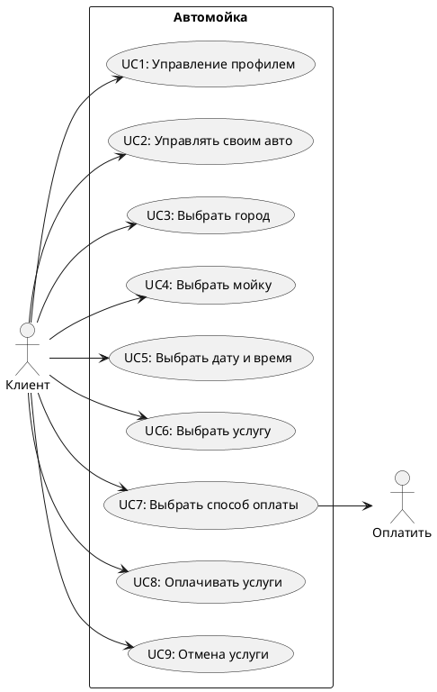

## <h2>UseCase diagram</h2>

## <h2>Сценарии использования</h2> 
  
UC4: Найти и выбрать автомойку. 

- `Участники` - Пользовательские приложения.  
- `Предусловия` - Пользователь зарегетрирован и авторизован.  
- `Условие для запуска сценария` - Пользователь нажимает кнопку "Найти Мойку". 
- `Признак успешности` - Пользователь выбрад автомойку. 

### <h2>Базовый сценарий</h2>

1. Система проверяет, что клиент передал свою геолокацию  
   ЕСЛИ: Геолокации нет,  
   ТО: Система переходит к "Базовому сценарию 3"  
3. Система ищет ближайщие к позициии клиента мойки
4. Система формирует список ближайщих моик
5. Система отображает экран с картой и списки моик
6. Система ожидает выбора мойки
7. Система переходит к экрану выбора услуг
8. Сценарий завершён

### <h2>Базовый сценарий 2</h2>

1. Система выводит сообщение клиента с просьбой разрешить передачу геолокации
2. ЕСЛИ: клиент разрешил доступ к геолокации  
   ТО: Система переходит в "Базовый сценарий шаг 2"  
   ИНАЧЕ: Система переходит с "Базовому сценарию 3"  

### <h2>Базовый сценарий 3</h2>

1.Система отображает поле для ввода адреса
2.Система ожидает от клиента ввода адреса
3.Система переходит в "Базовый сценарий шаг 2"

